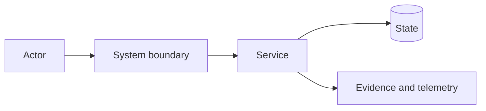

## Summary

Describe the proposal, the problem it addresses, and the recommended direction. This section should stand on its own.

## Status

Draft / Needs QART / In review / Ready for decision / Accepted / Rejected / Superseded

## Motivation

Explain the current limitation, user or operator impact, security or governance concern, strategic value, and why the change should be considered now.

## Goals

- <Required outcome>

## Non-goals

- <Adjacent work intentionally excluded>

## Current state

Describe the relevant architecture, workflows, components, interfaces, trust boundaries, constraints, failure modes, and prior decisions.

## QART decision slices

Create one bounded question per material decision.

| Question | Alternatives | Recommendation | Trade-off | Status / ADR |
|---|---|---|---|---|
| <Neutral decision question> | <Credible options> | <Recommendation or pending> | <Accepted cost> | <Status or link> |

For substantial analysis, link separate QART documents using the organization template.

## Proposed design

Describe:

- Components and responsibilities
- Interfaces and contracts
- Data and control flow
- State ownership and consistency
- Integration points
- Deployment model
- Trust and authorization boundaries
- Failure handling
- Evidence and observability

## Architecture and data flow

Replace the example with the actual design.

## Alternatives considered

### Alternative: <name>

- **Description:**
- **Advantages:**
- **Disadvantages:**
- **Security and operational impact:**
- **Compatibility and migration:**
- **Reversibility:**
- **Reason selected or rejected:**

## Security and governance

- Assets and threat actors:
- Abuse cases and attack paths:
- Trust boundaries:
- Authentication, authorization, and delegation:
- Secret and sensitive-data handling:
- Required approvals and policy enforcement:
- Evidence, provenance, and retention:
- Fail-open or fail-closed posture:
- Residual risk:

## Operational design

- Deployment and configuration:
- Health, metrics, logs, traces, and alerts:
- Capacity and resource limits:
- Backup, recovery, and incident response:
- Ownership and troubleshooting:

## Compatibility, migration, and rollout

- Existing consumers:
- Public contracts and versioning:
- Mixed-version behaviour:
- Data or configuration migration:
- Staged rollout:
- Rollback:
- Deprecation:

## Validation strategy

- Prototypes or spikes
- Contract and integration tests
- Security and adversarial tests
- Failure injection
- Compatibility and migration tests
- Performance and capacity tests
- Operational exercise or demo

State the concrete evidence required for approval.

## Delivery plan

### Phase 1: <foundation>

- **Outcome:**
- **Scope:**
- **Validation:**
- **Rollback:**

### Phase 2: <integration or adoption>

<Repeat as needed.>

## Risks and mitigations

| Risk | Likelihood | Impact | Mitigation |
|---|---:|---:|---|
| <Risk> | Low / Medium / High | Low / Medium / High | <Mitigation> |

## Unresolved questions

Include only decisions that materially affect approval. Identify alternatives, evidence needed, recommendation, and decision owner.

## Decision and outputs

- **Disposition:** Pending / Accepted / Rejected / Withdrawn / Superseded
- **Decision owners:**
- **Required ADRs:**
- **Required specifications:**
- **Parent epic or plan:**
- **Delivery issues:**
