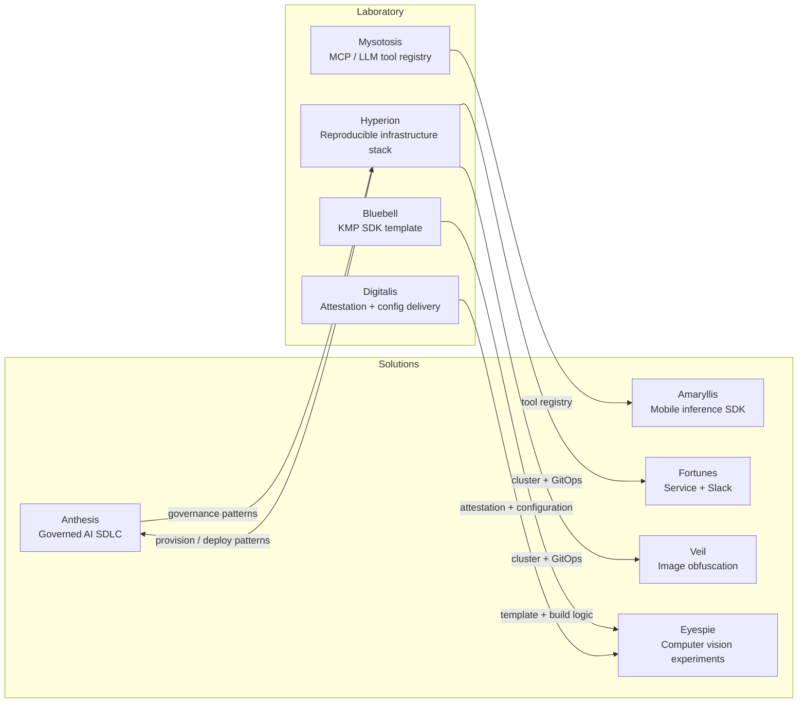

# 🌿 Micrantha

**Engineering resilient software systems.**

Micrantha is an engineering studio and open‑source ecosystem focused on building secure, observable platforms and disciplined AI‑assisted development systems. Its work explores how modern software can remain **understandable, operable, and secure** as systems evolve over time.

Core areas of focus include **platform engineering**, **mobile systems**, **infrastructure automation**, and **governed AI‑assisted development**.

🌐 [https://micrantha.com](https://micrantha.com)

---

## 🌱 Philosophy

Micrantha treats software as a **living ecosystem**—one that evolves through observation, iteration, and refinement rather than a one‑time construction effort.

Systems grow through a continuous engineering loop:

This reflects the Micrantha gardening metaphor, where systems develop and mature through careful cultivation and iteration.

| Garden element | Engineering meaning                          |
| -------------- | -------------------------------------------- |
| Soil           | Infrastructure and architectural foundations |
| Seed           | Initial design and constraints               |
| Water          | Iteration and engineering effort             |
| Sunlight       | Observability and real‑world feedback        |
| Flower         | Delivered system                             |
| Garden         | Ecosystem of systems maintained over time    |

The objective is simple: build systems that **remain understandable and maintainable as they grow**.

---

## ⚙️ What we build

These domains represent the primary areas of engineering focus across Micrantha projects and research. Together they form the foundation of the Micrantha ecosystem and shape how platforms, infrastructure, and experimental systems evolve and interact.

The projects described later combine these domains in different ways to explore, prototype, and operate real systems.

### Platform engineering

* Reproducible environments
* Safe delivery (GitOps / CI/CD)
* Secrets management and configuration hygiene
* Observability‑first operations

### Mobile systems

* Android (Kotlin) and iOS (Swift)
* React Native with native module integration
* Kotlin Multiplatform SDK development
* Mobile authentication flows and platform hardening
* On‑device inference experiments
* Mobile security: pentest analysis, device attestation, code obfuscation, and cryptographic agility

### AI‑assisted development

* Agent‑assisted workflows with **governance**
* Traceability (RFCs → plans → tasks → implementation)
* Deterministic and reviewable automation
* Context engineering (prompt design, token‑efficient context management, reusable skills)

### Security engineering

* Authentication models (OAuth, PKCE, token strategies)
* Threat modeling
* Secure coding practices and dependency hygiene
* Secrets management and supply‑chain awareness
* Security treated as a **system property** rather than a feature

---

## 🗺️ Architecture map

This diagram illustrates how core Micrantha projects relate—showing how deployable **Solutions** and experimental **Laboratory** projects connect across infrastructure and platforms.

High‑level relationships across the Micrantha ecosystem (not all repositories shown):

---

## 🌿 Project maturity model

Micrantha projects move through practical development stages that reflect increasing stability and operational readiness.

| Stage          | Meaning                                            |
| -------------- | -------------------------------------------------- |
| **Prototype**  | Early exploration or architectural experimentation |
| **Incubating** | Active development with stabilizing architecture   |
| **Stable**     | Production‑ready system with reliable interfaces   |
| **Maintained** | Mature system supported long‑term                  |

---

## 📦 Projects

Projects are organized into two groups:

* **Solutions** — deployable systems and platforms
* **Laboratory** — experimental projects exploring new capabilities and architectural approaches

### Solutions

* **[Anthesis](anthesis.micrantha.com)** *(Incubating)* — governed AI‑assisted SDLC platform focused on traceable decisions and disciplined automation
* **[Amaryllis](amaryllis.micrantha.com)** *(Prototype)* — mobile inference toolkit exploring privacy‑preserving on‑device ML
* **[Fortunes](fortunes.micrantha.com)** *(Stable)* — lightweight microservice and Slack integration used to explore deployment patterns
* **[Veil](veil.micrantha.com)** *(Prototype)* — experimental service for image obfuscation and privacy utilities

### Laboratory

* **[Hyperion](hyperion.micrantha.com)** *(Incubating)* — reproducible infrastructure stack built around K3s and GitOps workflows
* **[Bluebell](github.com/hackelia-micrantha/bluebell)** *(Stable)* — Kotlin Multiplatform SDK template supporting cross‑platform library development
* **Digitalis** *(Prototype)* — mobile attestation and secure configuration delivery system
* **Mysotosis** *(Prototype)* — experimental MCP / LLM registry for agent tool discovery
* **Eyespie** *(Prototype)* — computer‑vision‑driven gameplay experiments

---

## 🧠 Technical credibility

* 15+ years of engineering across mobile, backend, infrastructure, and security
* Experience delivering production mobile systems used by millions of users across enterprise and consumer platforms
* Strong emphasis on operational learning: CI/CD guardrails, observability, and incident feedback loops

Credentials and trajectory:

* CSSLP (Associate)
* Kubernetes CKA / CKS (planned)
* Azure certifications (planned)

---

## 📊 Operational posture

Micrantha projects treat **operability as a first‑class design constraint**. Systems are expected to be observable, diagnosable, and recoverable in production.

Typical operational practices include:

* **GitOps deployments** using declarative infrastructure
* **Reproducible environments** through infrastructure as code
* **Observability‑first design** (logs, metrics, and traces)
* **Operational runbooks** for known failure modes
* **Incident learning loops** to prevent recurrence

Operational priorities:

* predictable deployments
* rapid fault isolation
* minimal blast radius
* reversible changes

For systems reaching **Stable** or **Maintained** maturity, projects typically introduce:

* service health checks
* monitoring and alerting
* SLO‑informed operational decisions

---

## 🔐 Security posture

Micrantha treats security as an **architectural property of the system**, not an afterthought.

Security practices commonly emphasized include:

* **Threat modeling during system design**
* **Secure authentication models** (OAuth, PKCE, token lifecycle management)
* **Secrets management and rotation**
* **Clear trust boundaries between services**
* **Supply‑chain awareness** for dependencies and build pipelines

Security goals:

* minimize attack surface
* isolate trust domains
* prevent secret leakage
* enable rapid patching when vulnerabilities emerge

Where appropriate, projects may also incorporate:

* SBOM generation
* artifact signing
* dependency auditing

These practices help ensure systems remain **secure as they evolve and scale**.

---

## 📬 Contact

Ryan Jennings
Micrantha Software Solutions

🌐 [https://micrantha.com](https://micrantha.com)

---

> Systems that grow without discipline eventually collapse under their own complexity.
