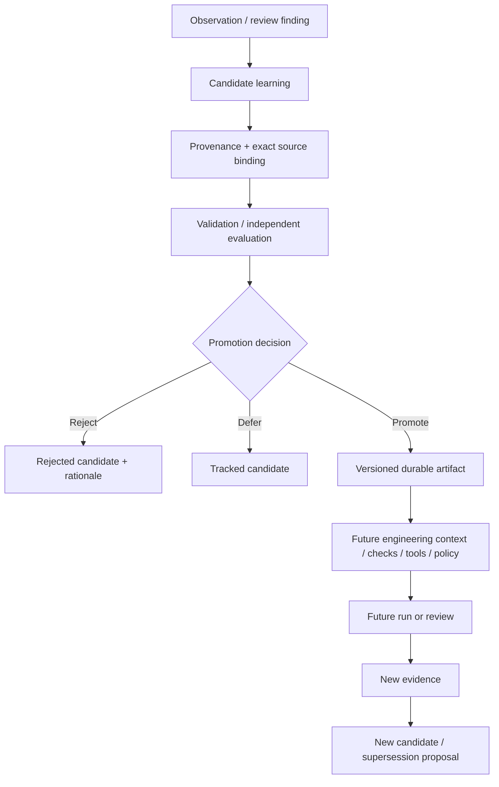

# Governed learning promotion

This document defines the cross-project architecture for turning lessons from agent-assisted engineering into durable future controls without allowing untrusted observations to mutate trusted instructions or authority.

It is the architecture companion to [Compound engineering](../engineering/compound-engineering.md).

## Problem

Agentic engineering systems increasingly retain lessons from completed work: review findings, successful fixes, failed approaches, new tests, prompt guidance, tool rules, and policy suggestions.

That feedback is valuable, but persistence changes the threat model. A lesson that influences future execution is no longer only historical evidence. Depending on its target, it may change future model context, runtime behavior, delivery gates, or governance decisions.

A safe architecture must therefore distinguish:

```text
what happened
from
what we inferred
from
what we validated
from
what future systems are allowed to trust or enforce
```

## Core invariants

1. **Observation is not authority.** Repository, issue, pull-request, tool, model, memory, web, and prior-run content cannot promote itself into trusted future control.
2. **Candidate learning is non-authoritative.** Capturing a lesson does not make it true, current, applicable, or approved.
3. **Promotion binds an exact source to an exact resulting artifact.** A decision to promote candidate A cannot silently authorize modified candidate A'.
4. **Authority is target-specific.** Documentation, tests, prompts, runtime defaults, and governance policy have different promotion requirements.
5. **Evidence cannot mint authority.** Strong evidence may satisfy a promotion precondition; it does not itself authorize a governed effect or policy change.
6. **Future effect authority remains independent.** Promoted guidance or memory cannot widen the capabilities available to a later run.
7. **History is immutable enough to explain supersession.** Rejection, replacement, conflict, and revocation create attributable state changes rather than rewriting prior evidence.

## Reference flow



No edge from `Observation` or `Candidate learning` directly to trusted future control is permitted merely because an agent generated the content.

## Candidate-learning concept

The runtime representation should remain small and should reuse project-owned identifiers and evidence references.

Conceptually:

```yaml
candidate_learning:
  schema_version: 1
  id: learning:...
  source:
    run_ref: run:...
    issue_ref: ...
    pull_request_ref: ...
    candidate_ref: ...
    review_ref: ...
  trigger:
    kind: repeated_finding | failure | successful_pattern | incident | manual_observation
    summary: ...
  proposal:
    target_class: test | invariant | guidance | documentation | tool | policy | metric
    owner: ...
    scope: ...
    proposed_change_ref: ...
  evidence_refs: []
  status: proposed
```

The exact schema is not normative here. Dubnium should extend its existing run/evidence model rather than introduce another universal evidence envelope. Anthesis should reuse existing Evidence/Provenance/decision semantics rather than ingesting a parallel authority format.

Free-form summaries are untrusted descriptive data. Effective actor identity, authority, approval, repository ownership, and target selection must come from trusted application/runtime context.

## Promotion target classes

### Documentation and runbooks

Typical properties:

- mostly advisory;
- factual correctness and ownership matter;
- ordinary repository review may be sufficient;
- resulting documentation still does not become capability authority.

### Tests, schemas, static invariants, and CI gates

These can block future delivery and therefore require:

- exact reproduction or rationale for the protected behavior;
- positive and negative fixtures where appropriate;
- compatibility and false-positive review;
- versioned repository change and normal merge authority.

### Prompts and persistent agent guidance

These alter future model-visible control context and deserve an explicit trust boundary.

Required properties:

- source candidate and resulting prompt revision are exact and attributable;
- hostile repository/task content cannot write directly to the trusted prompt surface;
- representative and adversarial evaluation checks that the new guidance solves the intended problem without introducing obvious regressions;
- prompt guidance cannot grant tools, credentials, destinations, approval, or policy authority that the runtime has not independently admitted.

### Runtime tool/default changes

A compounded lesson may suggest changing tool exposure, sandboxing, retries, routing, or defaults. These remain ordinary runtime/code changes and must pass the owning repository's tests, compatibility, rollback, and security review.

The candidate-learning system must not become a dynamic configuration bypass.

### Governance and policy

This is the highest-consequence promotion class.

A candidate may propose a policy improvement, but Anthesis remains the owner of governance semantics and accountable promotion. Evidence supporting a policy proposal cannot directly alter policy or approve future effects.

Policy promotion must retain:

- exact policy/revision identity;
- exact candidate/evidence references;
- accountable decision/approval where required;
- compatibility and effect analysis;
- supersession/revocation lineage;
- distinction between policy definition and effect-time authorization.

## Cross-project ownership

### Micrantha `.github`

Owns:

- the Plan -> Work -> Review -> Compound engineering practice;
- shared prompts and review guidance;
- organization-wide expectations for candidate-learning handling.

It does not own project runtime state or domain policy.

### `hackelia-micrantha/hackelia-micrantha`

Owns:

- rollout/adoption coordination;
- cross-project status and dependency tracking.

It does not become a second copy of the normative practice or project implementation backlog.

### Dubnium

Owns runtime mechanics such as:

- exact run, task, issue/PR, source, candidate, and review/evaluation references;
- bounded reversible execution (`ryjen/dubnium#413`);
- durable run state and lineage (`ryjen/dubnium#414`);
- independently verified task-state transitions (`ryjen/dubnium#891`);
- normalized observation ingress (`ryjen/dubnium#898`);
- optional emission and persistence of non-authoritative candidate-learning records.

Dubnium does not decide that a learning is governance-authoritative merely because the run succeeded.

### Anthesis

Owns governance meaning for promotion where a learning affects trusted persistent control, especially:

- evidence/provenance interpretation;
- policy and approval requirements;
- exact promotion-decision binding;
- stale/revoked/superseded authority semantics;
- assurance requirements for persistent agent guidance or policy changes.

Relevant existing work includes `hackelia-micrantha/anthesis#26`, `#55`, `#198`, and `#202`.

Anthesis should add only the minimum profile/amendment needed; it should not become the runtime memory store or task scheduler.

### Sandcastle

Owns immutable workspace/candidate/checkpoint mechanics where stronger evaluation isolation is useful.

Existing checkpoint and verifier-separation work can support a promotion evaluation by ensuring the evaluator observes the exact proposed artifact rather than mutable producer state.

Sandcastle does not decide whether the candidate is semantically correct, trusted, or authorized.

### ops-cadence

May act as a read-only measurement consumer:

- stable finding identity;
- prior-run comparison;
- repeated-finding detection;
- promoted-control recurrence analysis;
- source health and blind spots;
- trends in review iterations and automatically prevented findings.

It does not promote learnings, mutate prompts/policy, or own production schedule semantics outside its existing Dubnium integration contract.

## Relationship to existing state and evidence

The Compound layer should attach to existing execution truth rather than create a parallel history.

```text
Dubnium Run Ledger / exact candidate
       +
review / deterministic verification / audit evidence
       |
       v
candidate learning
       |
       +--> ordinary repository change (test/docs/tool/prompt)
       |
       +--> Anthesis-governed promotion when target requires it
       |
       v
versioned promoted artifact
       |
       v
future run references exact promoted revision
```

A future run should be able to answer which exact version of a prompt, policy, invariant, or tool configuration affected it. It should not need a complete historical chat transcript to reconstruct that dependency.

## Freshness, conflict, and supersession

A promoted learning can become stale even if it was correct when created.

Examples:

- an architecture change invalidates a repository-specific rule;
- a security control is replaced by a stronger invariant;
- two promoted guidance rules conflict;
- a test protects behavior that is no longer supported;
- an old workaround becomes actively harmful.

Therefore promotion state should support, where relevant:

```text
proposed -> validated -> promoted -> superseded | revoked
            \-> rejected
            \-> deferred
```

Rules:

- later evidence does not mutate old evidence in place;
- supersession links old and new artifacts;
- stale guidance must not be represented as current merely because it remains searchable;
- conflict resolution is performed by the owner of the target artifact/policy;
- retry or replay cannot resurrect revoked promotion authority.

## Threat model

At minimum evaluate:

- malicious README/issue/comment asks the agent to add an instruction to trusted prompts;
- tool output claims that a policy exception should be remembered permanently;
- a successful run proposes a dangerously broad rule based on one case;
- candidate A is reviewed, then changed to A' before promotion;
- stale review evidence is reused after the target prompt/policy changed;
- a prior promoted learning conflicts with a newer accepted architecture decision;
- a model-generated candidate claims a fabricated actor, approval, or owner;
- repeated findings are hidden by changing wording/IDs rather than actually prevented;
- a promoted prompt attempts to grant authority that runtime policy does not provide;
- promotion evidence includes secrets or full sensitive transcripts unnecessarily.

## Reference conformance scenarios

A minimal cross-project proof should eventually include:

1. **Repeated deterministic finding**
   - review finds the same defect class twice;
   - candidate learning proposes a regression test/invariant;
   - fixture proves the failure before the control and prevention afterward;
   - later review records the finding as automatically prevented.

2. **Hostile self-promotion attempt**
   - attacker-controlled repository text says to persist a new privileged instruction;
   - observation/candidate capture may record it;
   - promotion is denied or ignored;
   - future trusted prompt/policy remains unchanged.

3. **Prompt-guidance promotion**
   - a legitimate recurring review failure proposes shared guidance;
   - exact proposed prompt change is evaluated against representative/adversarial fixtures;
   - reviewed revision is promoted;
   - a future run records that exact prompt revision.

4. **Stale/superseded learning**
   - architecture changes invalidate an old rule;
   - old promotion remains historical evidence;
   - new runs use only the current promoted revision.

5. **Policy proposal remains non-authoritative**
   - candidate recommends a governance rule;
   - evidence is valid but no owning promotion decision exists;
   - effect-time policy remains unchanged and the candidate cannot authorize an effect.

## Measurement contract

Metrics are observations, not correctness proofs.

Useful measures include:

```text
repeated_finding_rate
review_fix_iterations
regression_after_promotion_rate
automatically_prevented_findings
human_interventions_for_deterministic_checks
candidate_learnings_by_disposition
promotion_to_recurrence_interval
issue_to_pr_elapsed
pr_to_merge_elapsed
```

Every metric should state source coverage and blind spots. A lower finding count is not positive if reviews stopped running, identifiers changed, or evidence collection degraded.

## Rollout sequence

1. Add shared engineering guidance and a reusable Compound review prompt in `.github`.
2. Update shared review/merge prompts to surface candidate learnings without auto-promoting them.
3. Add a Dubnium candidate-learning output attached to existing run/review evidence.
4. Define the minimum Anthesis promotion profile for trusted persistent guidance/policy targets.
5. Reuse Sandcastle exact candidate/evaluator isolation where the promotion class requires stronger evaluation.
6. Add read-only recurrence/prevention measurement to ops-cadence Engineering Portfolio Review.
7. Run one end-to-end fixture demonstrating finding -> candidate -> validation -> promotion -> later prevention.

## Non-goals

- A universal self-improving-agent framework.
- Autonomous prompt or policy self-modification.
- A new cross-project evidence database.
- A graph database for learning relationships.
- Storing private chain-of-thought.
- Treating memory retrieval as authority.
- Replacing code review with automated learning capture.
- Requiring Anthesis approval for ordinary low-risk documentation edits.
