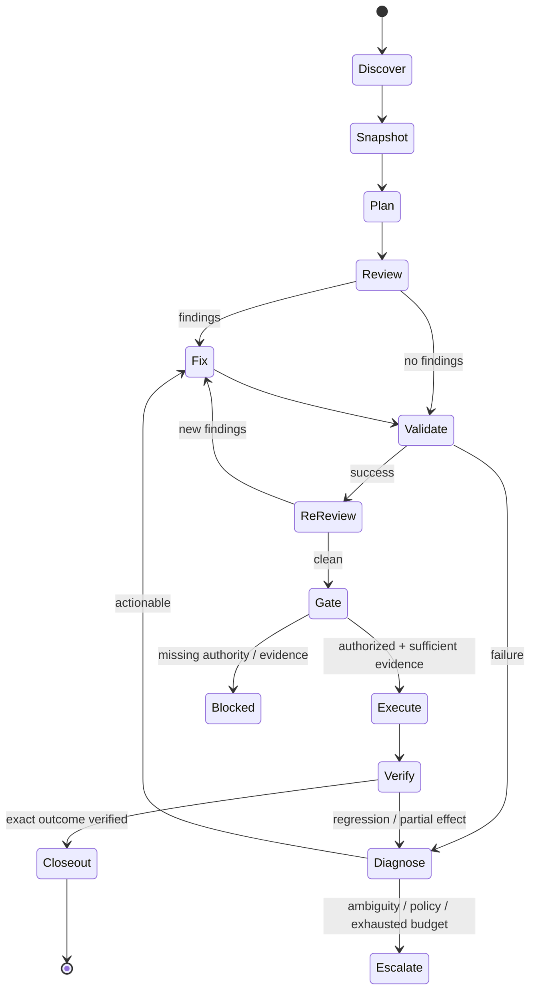

# Long-running agent execution contract

Micrantha uses this contract to make long-running agent work predictable across interactive ChatGPT/Codex sessions and future governed runtimes.

It operationalizes [AI-assisted SDLC phase discipline](./ai-assisted-sdlc.md). It is a workflow contract, not a new workflow engine, policy engine, evidence format, or authority source.

The core model is:

```text
Run = Goal + Graph + Policy + State + Evidence + Budget
```

These concerns stay separate because they answer different questions:

| Concern | Question |
| --- | --- |
| Goal | What outcome is this run trying to reach? |
| Graph | Which state transitions are valid next? |
| Policy | Which otherwise-valid transitions are authorized? |
| State | Where is the run now, against which exact subject? |
| Evidence | What supports the claims required by the next transition? |
| Budget | How much retry/investigation is permitted before escalation? |

Conversation history may help reconstruct context, but it is not canonical run state when correctness, recovery, authority, or later transitions depend on that state.

## Default execution graph

For non-trivial implementation and repository work, use this default shape unless a project-owned workflow defines a stronger one:



The graph is intentionally cyclic. A loop is useful only when each cycle changes either the candidate, the evidence, or the hypothesis. Repeating an unchanged causal hypothesis is not progress.

## State semantics

At minimum, a durable run ledger should be able to identify:

- run identity;
- goal;
- current graph state;
- exact subject/revision/candidate identity;
- unresolved findings;
- evidence gathered and evidence still required;
- policy gates currently relevant;
- retry/investigation counters;
- blockers and escalation reason;
- next eligible transitions.

A compact representation is sufficient. For example:

```yaml
run: tidyfs-release-review-2026-09-12
goal: qualify PR 80 for merge
state: re-review
subject:
  repository: ryjen/tidyfs
  pr: 80
  head: af81c72
findings:
  unresolved: 0
evidence:
  exact_head: af81c72
  required:
    unit: passed
    integration: passed
    release_contract: passed
policy:
  merge_requires_exact_head: true
  merge_authorized: false
budget:
  fix_cycles: 2
  max_fix_cycles: 6
  same_failure: 0
  max_same_failure: 2
next:
  - gate
```

Do not infer authorization from the presence of a state file, a green check, a confident model conclusion, or a previous approval bound to another candidate.

## Transition rules

### Discover -> Snapshot

Resolve authoritative repository/project state before planning mutations. Prefer current code, issues, PR heads, CI state, accepted decisions, and repository-owned documentation over remembered conversation state.

Snapshot the exact subject identity when later evidence must bind to it.

### Snapshot -> Plan

Plan only what is needed to reach the requested outcome. Reuse accepted repository decisions and existing issues rather than creating parallel architecture.

For large work, decompose until each increment has:

- bounded mutation scope;
- explicit exit criteria;
- practical validation;
- recoverable failure semantics.

### Plan -> Review -> Fix

Review before mutation when the task is primarily repair, qualification, or continuation of existing work.

Findings should distinguish at least:

- correctness/security defect;
- missing requirement;
- missing or stale evidence;
- infrastructure/environment failure;
- ambiguity/decision gap;
- non-blocking cleanup.

Do not change implementation merely because validation failed until the failure has been classified enough to support a causal hypothesis.

### Fix -> Validate

Every material change invalidates evidence that was bound to the prior candidate unless the evidence contract explicitly remains valid.

Validation should prefer the least expensive reliable evidence that can decide the required property:

1. integrity/schema/exact-subject checks;
2. compiler/static/type checks;
3. deterministic tests/property checks;
4. artifact/diff/runtime inspection;
5. independent semantic verification where necessary;
6. human disposition where consequence or uncertainty requires it.

### Validate -> Re-review

Green checks are evidence, not semantic completion.

After a repair, re-review the resulting candidate against the original goal, findings, architectural constraints, and applicable policy. This catches repairs that satisfy a test while introducing a new defect, narrowing a contract incorrectly, or changing the intended behavior.

### Re-review -> Gate

A gate evaluates whether the next effect is both valid and authorized.

Typical gated effects include:

- merge;
- release/tag/publication;
- deployment;
- destructive deletion;
- permissions or credential changes;
- external communication;
- issue/acceptance closure when closure makes a consequential claim;
- cross-repository mutation outside the already authorized scope.

A gate is not satisfied by intent to proceed. It requires the policy-defined evidence and authority for the exact current subject.

### Execute -> Verify

Execution success is distinct from outcome verification.

Examples:

```text
PR API returned merged
  != target branch contains intended exact result

release job succeeded
  != published artifacts are complete and consumable

deployment command succeeded
  != service is healthy at the intended revision
```

Verify the externally observable result before closeout when the effect is consequential.

## Continuation policy

For an authorized long-running run, continue automatically through reversible, low-risk transitions while useful work remains.

Do not stop merely because:

- CI is queued or running;
- one independent check is pending;
- an external reviewer has not yet responded;
- a subtask completed while other graph branches remain actionable.

Instead, perform independent useful review, inspection, documentation, issue reconciliation, or evidence gathering that does not depend on the pending result.

Pause or escalate only when the next meaningful transition is actually blocked by policy, missing evidence, unavailable access, or material ambiguity.

## Loop classes

Use explicit loop classes so repetition has a reason:

| Loop | Shape | Purpose |
| --- | --- | --- |
| Implementation | review -> fix -> validate | repair candidate defects |
| Qualification | validate -> inspect evidence -> re-review | establish readiness claims |
| Integration | execute/merge -> downstream validate -> repair | prove composed behavior |
| Discovery | inspect -> hypothesis -> gather evidence | reduce uncertainty |
| Recovery | classify failure -> isolate -> repair -> reproduce | restore a failed path |
| Governance | proposed effect -> policy -> approval -> execute -> attest | control consequential effects |

A run may nest loop classes, but the ledger should make the active loop and exit criterion clear enough to resume safely.

## Retry and investigation budgets

Unbounded retries hide stagnation and consume reviewer attention.

Default guidance unless a project defines stronger limits:

- same causal failure twice without materially new evidence: change the hypothesis or escalate;
- repeated tool/infrastructure failure: classify separately from product failure and use a bounded retry count;
- implementation repair cycles: use a declared budget proportional to task size and risk;
- destructive or consequential effects: never use blind retry semantics unless the operation is explicitly idempotent and policy permits it.

Budget exhaustion does not authorize broader access, looser validation, or weaker acceptance criteria.

## Escalation conditions

Escalate rather than improvise when:

- a policy requires human authorization;
- requirements are materially ambiguous and different interpretations change the outcome or risk;
- required credentials/access/capabilities are unavailable;
- required evidence cannot be produced with the available verifier/runtime;
- two materially different approaches remain and choosing incorrectly has significant consequence;
- the same causal failure persists after the configured retry threshold;
- the investigation or repair budget is exhausted;
- newly discovered architecture materially widens scope or authority.

Escalation should report the exact blocked transition, evidence already gathered, safe work already completed, and the smallest decision or capability needed to continue.

## Effect policy

Reasoning authority remains broader than execution authority.

A run may inspect and reason across a broad system while mutation authority remains narrow. Project prompts may grant write authority for a bounded repository/task without granting merge, release, deployment, deletion, credential, or external-communication authority.

Authorization should be interpreted against:

- the requested effect;
- repository/local policy;
- the exact subject/candidate;
- freshness/currentness requirements;
- explicit user or governance approval when required.

Do not carry approval silently across materially changed candidates when the approval/evidence was bound to the prior candidate.

## Project overlays

Projects may specialize this contract with local:

- graph nodes/edges;
- required checks;
- retry budgets;
- human-review gates;
- release/deployment transitions;
- evidence formats;
- run-state storage;
- model-selection/escalation rules.

Project overlays should strengthen or specialize organization semantics rather than copy the entire contract.

A project-local `AGENTS.md`, skill, issue, policy file, or runtime configuration may express the overlay. The owning repository remains authoritative for its implementation behavior.

## Enforcement ownership

This document defines reusable engineering semantics only.

- **Anthesis** owns policy evaluation, approval, evidence sufficiency, and governed lifecycle semantics where enforced.
- **Dubnium** owns bounded execution, durable runtime state, recovery, and runtime evidence where used.
- **Sandcastle** may own mutable-workspace/checkpoint isolation.
- **Testule/native tools** own executable validation within their contracts.
- **Repositories** own project-specific graph overlays, tests, acceptance criteria, release requirements, and implementation decisions.
- **`.github`** owns this shared guidance and reusable prompt contract.

Do not create a second workflow or policy runtime merely to implement this document.

## Completion contract

A long-running run is complete only when it reaches a terminal state or an explicitly reported blocked/escalated state.

Normal successful closeout reports:

- outcome achieved;
- exact resulting revision/state;
- material changes made;
- validation/evidence obtained;
- consequential effects executed;
- post-effect verification result;
- remaining non-blocking work or deliberately deferred items.

A blocked closeout reports:

- blocked graph transition;
- reason;
- exact current subject/state;
- evidence already obtained;
- retries/investigation already attempted;
- smallest requirement for continuation.

## Non-goals

- universal orchestration framework;
- replacing project-local SDLC or release processes;
- automatic authority escalation;
- treating multiple model reviewers as independent evidence by default;
- requiring persistent state for trivial one-step work;
- using a graph as proof that the resulting software is correct.
