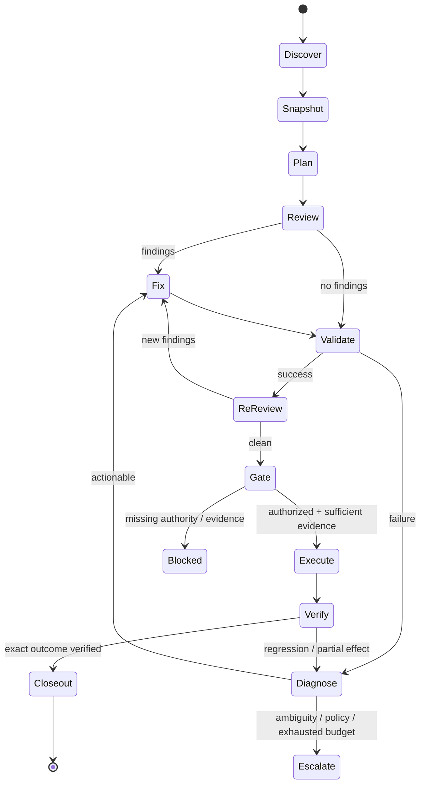

# Long-running agent execution contract

Micrantha uses this contract to make long-running agent work predictable across interactive ChatGPT/Codex sessions and future governed runtimes.

It operationalizes [AI-assisted SDLC phase discipline](./ai-assisted-sdlc.md). It is a workflow contract, not a new workflow engine, policy engine, evidence format, or authority source.

The core model is:

```text
Run = Goal + Graph + Policy + State + Evidence + Budget
```

These concerns stay separate because they answer different questions:

| Concern | Question |
| --- | --- |
| Goal | What outcome is this run trying to reach? |
| Graph | Which state transitions are valid next? |
| Policy | Which otherwise-valid transitions are authorized? |
| State | Where is the run now, against which exact subject? |
| Evidence | What supports the claims required by the next transition? |
| Budget | How much retry/investigation is permitted before escalation? |

Conversation history may help reconstruct context, but it is not canonical run state when correctness, recovery, authority, or later transitions depend on that state.

## Default execution graph

For non-trivial implementation and repository work, use this default shape unless a project-owned workflow defines a stronger one:


```mermaid
stateDiagram-v2
    [*] --> Discover
    Discover --> Snapshot
    Snapshot --> Plan
    Plan --> Review
    Review --> Fix: findings
    Review --> Validate: no findings
    Fix --> Validate
    Validate --> ReReview: success
    Validate --> Diagnose: failure
    Diagnose --> Fix: actionable
    Diagnose --> Escalate: ambiguity / policy / exhausted budget
    ReReview --> Fix: new findings
    ReReview --> Gate: clean
    Gate --> Execute: authorized + sufficient evidence
    Gate --> Blocked: missing authority / evidence
    Execute --> Verify
    Verify --> Closeout: exact outcome verified
    Verify --> Diagnose: regression / partial effect
    Closeout --> [*]
```

The graph is intentionally cyclic. A loop is useful only when each cycle changes either the candidate, the evidence, or the hypothesis. Repeating an unchanged causal hypothesis is not progress.

## State semantics

At minimum, a durable run ledger should be able to identify:

- run identity;
- goal;
- current graph state;
- exact subject/revision/candidate identity;
- last externally verified state and observation;
- any potentially in-flight external effect and whether it is known idempotent;
- unresolved findings;
- evidence gathered and evidence still required;
- policy gates currently relevant;
- retry/investigation counters;
- blockers and escalation reason;
- next eligible transitions.

A compact representation is sufficient. For example:

```yaml
run: tidyfs-release-review-2026-09-12
goal: qualify PR 80 for merge
state: re-review
subject:
  repository: ryjen/tidyfs
  pr: 80
  head: af81c72
last_verified:
  state: validate
  subject: af81c72
  observation: required checks read back as passed for exact head
in_flight:
  operation: none
  idempotent: true
findings:
  unresolved: 0
evidence:
  exact_head: af81c72
  required:
    unit: passed
    integration: passed
    release_contract: passed
policy:
  merge_requires_exact_head: true
  merge_authorized: false
budget:
  fix_cycles: 2
  max_fix_cycles: 6
  same_failure: 0
  max_same_failure: 2
next:
  - gate
```

Do not infer authorization from the presence of a state file, a green check, a confident model conclusion, or a previous approval bound to another candidate.

## Session recovery and resumption

Interactive AI sessions, browser/app connections, tool transports, and model processes may terminate at arbitrary points. Treat session loss like worker-process failure: the run may continue, but only after reconstructing state from authoritative external observations.

The default restart sequence is:

```text
recover -> reconcile -> continue
```

A replacement session must not assume either that the last conversationally described operation succeeded or that it failed. Phrases such as `creating PR`, `merging`, `deploying`, `running tests`, or `done` are not durable effect receipts.

On resumption:

1. resolve current authoritative repository/project/external-system state before any new mutation;
2. load the latest durable ledger or handoff when available, but reconcile it against current state rather than treating it as canonical by itself;
3. identify the exact current subject/revision and compare it with the last externally verified subject;
4. classify prior intended work as **verified complete**, **partial/uncertain**, **not started**, or **stale/conflicted**;
5. reconcile every uncertain external effect with a read-after-write or equivalent idempotency check before retrying it;
6. reconstruct the active graph node, unresolved findings, evidence, policy gates, and retry/investigation budget;
7. invalidate stale evidence or authorization that was bound to a materially different candidate;
8. resume from the first unverified eligible transition rather than replaying prior steps mechanically.

Typical effects requiring reconciliation include branch or file writes, issue/PR creation or updates, merges, releases, deployments, deletions, permission/credential changes, and external communications.

Repository-state reconciliation does **not** imply unconditional branch synchronization. A topic branch becoming behind `main` is an observation, not automatically a stale/conflicted state. Refresh and inspect the intervening `main` changes; merge/rebase/update the branch only when those changes materially interact with the candidate or its dependencies/contracts/build inputs, invalidate candidate-bound evidence or assumptions, create an actual merge conflict, or repository admission policy requires a composed-current-main candidate. Otherwise preserve the existing exact candidate and its valid evidence.

When an uncertain operation is not safely idempotent and its outcome cannot be established from authoritative state, the correct transition is `blocked/escalate`, not blind retry.

A recovered run inherits retry and investigation budget already consumed when that usage can be established. If counters are uncertain, choose a conservative value rather than resetting them to zero.

For multi-session work, a human-readable handoff may be as small as:

```markdown
Goal:
Current subject/revision:
Last verified state:
Completed and externally verified:
Partial or uncertain effects:
Unresolved findings/blockers:
Evidence obtained / still required:
Authority and active gates:
Retry budget already consumed:
Next safe transition:
Do not redo without reconciliation:
```

Persist this only when recovery, handoff, auditability, or runtime integration benefits from it. Do not create per-run state files merely for ceremony.

## Session resilience and context pressure

Long-running interactive sessions are disposable execution workers, not durable run records. Preserve correctness across context growth, transport instability, or worker replacement by keeping the run reconstructable from authoritative state plus a compact ledger/handoff.

### Context hygiene

Keep live context focused on the current graph transition. Prefer:

- exact repository, work-item, revision, run, job, and artifact identifiers over repeated narrative history;
- compact findings and evidence summaries that point back to durable source evidence;
- targeted file ranges, diffs, workflow jobs, and issue/PR state rather than repeatedly loading whole repositories, files, or logs;
- current accepted decisions and unresolved findings rather than retaining superseded discussion;
- the run ledger as the continuity representation when detailed conversational history is no longer needed.

Do not repeatedly reload or restate evidence that remains valid for the exact current candidate. When evidence becomes obsolete, superseded, or invalidated by a candidate change, remove it from the active working summary rather than carrying it forward indefinitely.

### Proactive checkpoint and rollover

Refresh a restart-safe ledger or handoff when doing so materially reduces recovery risk, especially when:

- a consequential effect completes;
- the exact candidate/revision changes materially;
- several review/fix/verify cycles or substantial cross-repository evidence have accumulated;
- large logs, diffs, research, or runtime observations have materially expanded working context;
- repeated tool/transport failures suggest session degradation;
- important identifiers, findings, or decisions are being repeatedly reconstructed;
- the execution runtime reports material context pressure.

When continuing in the current worker/session is materially riskier or more expensive than reconstruction from the compact ledger, use:

```text
checkpoint -> rollover -> recover -> reconcile -> continue
```

Rollover must not reset mutation/effect authority, retry or investigation budgets, unresolved findings, evidence freshness requirements, exact-candidate binding, or active policy gates.

Do not create persistent repository state merely to preserve chat context. Persist the ledger only when recovery, handoff, auditability, or runtime integration materially benefits from durable storage.

### Tool and transport failure semantics

Timeouts, disconnects, connector failures, provider failures, and session termination are infrastructure/transport outcomes until evidence establishes otherwise; they are not candidate/product failures by default.

For read-only or explicitly idempotent operations, use bounded retry/backoff where the runtime supports it. Repeated materially equivalent failures should trigger a changed hypothesis, narrower retrieval, checkpoint/rollover, or escalation rather than unbounded retry.

For mutations:

```text
timeout/disconnect != failed mutation
```

Treat the external effect as unknown until authoritative read-back establishes whether it occurred. Never blindly repeat a potentially non-idempotent mutation after a transport failure.

Runtime-specific wall-clock timeouts, context-window thresholds, restart mechanisms, cancellation semantics, and backoff schedules belong to the owning runtime/project configuration rather than this shared guidance.

### Refresh discipline

Refresh authoritative state:

- at initial discovery and recovery;
- after relevant external mutations;
- when externally mutable evidence may have changed;
- before consequential gates;
- when a material assumption becomes questionable.

Otherwise prefer targeted refresh of the affected subject over repeating a complete repository/status scan. Refresh the exact PR/head/checks when CI changes, the exact issue/thread when tracking changes, and the broader project graph only when dependencies, scope, or a final gate require it.

## Transition rules

### Discover -> Snapshot

Resolve authoritative repository/project state before planning mutations. Prefer current code, issues, PR heads, CI state, accepted decisions, and repository-owned documentation over remembered conversation state.

Snapshot the exact subject identity when later evidence must bind to it.

### Snapshot -> Plan

Plan only what is needed to reach the requested outcome. Reuse accepted repository decisions and existing issues rather than creating parallel architecture.

For large work, decompose until each increment has:

- bounded mutation scope;
- explicit exit criteria;
- practical validation;
- recoverable failure semantics.

### Plan -> Review -> Fix

Review before mutation when the task is primarily repair, qualification, or continuation of existing work.

Findings should distinguish at least:

- correctness/security defect;
- missing requirement;
- missing or stale evidence;
- infrastructure/environment failure;
- ambiguity/decision gap;
- non-blocking cleanup.

Do not change implementation merely because validation failed until the failure has been classified enough to support a causal hypothesis.

### Fix -> Validate

Every material change invalidates evidence that was bound to the prior candidate unless the evidence contract explicitly remains valid.

Validation should prefer the least expensive reliable evidence that can decide the required property:

1. integrity/schema/exact-subject checks;
2. compiler/static/type checks;
3. deterministic tests/property checks;
4. artifact/diff/runtime inspection;
5. independent semantic verification where necessary;
6. human disposition where consequence or uncertainty requires it.

### Validate -> Re-review

Green checks are evidence, not semantic completion.

After a repair, re-review the resulting candidate against the original goal, findings, architectural constraints, and applicable policy. This catches repairs that satisfy a test while introducing a new defect, narrowing a contract incorrectly, or changing the intended behavior.

### Re-review -> Gate

A gate evaluates whether the next effect is both valid and authorized.

Typical gated effects include:

- merge;
- release/tag/publication;
- deployment;
- destructive deletion;
- permissions or credential changes;
- external communication;
- issue/acceptance closure when closure makes a consequential claim;
- cross-repository mutation outside the already authorized scope.

A gate is not satisfied by intent to proceed. It requires the policy-defined evidence and authority for the exact current subject.

### Execute -> Verify

Execution success is distinct from outcome verification.

Examples:

```text
PR API returned merged
  != target branch contains intended exact result

release job succeeded
  != published artifacts are complete and consumable

deployment command succeeded
  != service is healthy at the intended revision
```

Verify the externally observable result before closeout when the effect is consequential. Record enough of the read-back that a replacement session can distinguish a completed effect from an interrupted one.

## Continuation policy

For an authorized long-running run, continue automatically through reversible, low-risk transitions while useful work remains.

Do not stop merely because:

- CI is queued or running;
- one independent check is pending;
- an external reviewer has not yet responded;
- a subtask completed while other graph branches remain actionable.

Instead, perform independent useful review, inspection, documentation, issue reconciliation, or evidence gathering that does not depend on the pending result.

Pause or escalate only when the next meaningful transition is actually blocked by policy, missing evidence, unavailable access, or material ambiguity.

## Loop classes

Use explicit loop classes so repetition has a reason:

| Loop | Shape | Purpose |
| --- | --- | --- |
| Implementation | review -> fix -> validate | repair candidate defects |
| Qualification | validate -> inspect evidence -> re-review | establish readiness claims |
| Integration | execute/merge -> downstream validate -> repair | prove composed behavior |
| Discovery | inspect -> hypothesis -> gather evidence | reduce uncertainty |
| Recovery | recover -> reconcile -> continue | reconstruct exact state after interruption and resume without duplicate effects |
| Failure recovery | classify failure -> isolate -> repair -> reproduce | restore a failed path |
| Governance | proposed effect -> policy -> approval -> execute -> attest | control consequential effects |

A run may nest loop classes, but the ledger should make the active loop and exit criterion clear enough to resume safely.

## Retry and investigation budgets

Unbounded retries hide stagnation and consume reviewer attention.

Default guidance unless a project defines stronger limits:

- same causal failure twice without materially new evidence: change the hypothesis or escalate;
- repeated tool/infrastructure failure: classify separately from product failure and use a bounded retry count;
- implementation repair cycles: use a declared budget proportional to task size and risk;
- destructive or consequential effects: never use blind retry semantics unless the operation is explicitly idempotent and policy permits it.

Budget exhaustion does not authorize broader access, looser validation, or weaker acceptance criteria.

### Causal convergence and stopping discipline

Before each substantive loop, identify the decision it serves, one causal intervention, its pass condition, and the consequence if it fails. Apply the consequence before choosing a next step; a successful command or interesting result does not itself justify more work.

When a gate fails, examine the complete causally relevant artifact and evidence, not a selected diagnostic excerpt, before naming a cause. Change one causal factor at a time so the result is attributable; accompanying tests and documentation may verify that same change. Never modify evidence or lower a gate merely to obtain a pass. A genuinely defective verifier requires its own justified review.

If a third attempt would reuse the same mechanism, prompt, instrument, or readers without material new evidence, change the lever or park/escalate. Three consecutive comparable failures of one gate require reconsidering the design and gate before another local defect fix. Existing retry limits and effect-authority boundaries still apply.

## Escalation conditions

Escalate rather than improvise when:

- a policy requires human authorization;
- requirements are materially ambiguous and different interpretations change the outcome or risk;
- required credentials/access/capabilities are unavailable;
- required evidence cannot be produced with the available verifier/runtime;
- two materially different approaches remain and choosing incorrectly has significant consequence;
- the same causal failure persists after the configured retry threshold;
- the investigation or repair budget is exhausted;
- newly discovered architecture materially widens scope or authority;
- a potentially consequential non-idempotent effect is uncertain and cannot be reconciled from authoritative state.

Escalation should report the exact blocked transition, evidence already gathered, safe work already completed, and the smallest decision or capability needed to continue.

## Effect policy

Reasoning authority remains broader than execution authority.

A run may inspect and reason across a broad system while mutation authority remains narrow. Project prompts may grant write authority for a bounded repository/task without granting merge, release, deployment, deletion, credential, or external-communication authority.

Authorization should be interpreted against:

- the requested effect;
- repository/local policy;
- the exact subject/candidate;
- freshness/currentness requirements;
- explicit user or governance approval when required.

Do not carry approval silently across materially changed candidates when the approval/evidence was bound to the prior candidate.

## Project overlays

Projects may specialize this contract with local:

- graph nodes/edges;
- required checks;
- retry budgets;
- human-review gates;
- release/deployment transitions;
- evidence formats;
- run-state storage;
- model-selection/escalation rules.

Project overlays should strengthen or specialize organization semantics rather than copy the entire contract.

A project-local `AGENTS.md`, skill, issue, policy file, or runtime configuration may express the overlay. The owning repository remains authoritative for its implementation behavior.

## Enforcement ownership

This document defines reusable engineering semantics only.

- **Anthesis** owns policy evaluation, approval, evidence sufficiency, and governed lifecycle semantics where enforced.
- **Dubnium** owns bounded execution, durable runtime state, recovery, and runtime evidence where used.
- **Sandcastle** may own mutable-workspace/checkpoint isolation.
- **Testule/native tools** own executable validation within their contracts.
- **Repositories** own project-specific graph overlays, tests, acceptance criteria, release requirements, and implementation decisions.
- **`.github`** owns this shared guidance and reusable prompt contract.

Do not create a second workflow or policy runtime merely to implement this document.

## Completion contract

A long-running run is complete only when it reaches a terminal state or an explicitly reported blocked/escalated state.

Normal successful closeout reports:

- outcome achieved;
- exact resulting revision/state;
- material changes made;
- validation/evidence obtained;
- consequential effects executed;
- post-effect verification result;
- remaining non-blocking work or deliberately deferred items.

A blocked closeout reports:

- blocked graph transition;
- reason;
- exact current subject/state;
- evidence already obtained;
- retries/investigation already attempted;
- smallest requirement for continuation.

## Non-goals

- universal orchestration framework;
- replacing project-local SDLC or release processes;
- automatic authority escalation;
- treating multiple model reviewers as independent evidence by default;
- requiring persistent state for trivial one-step work;
- using a graph as proof that the resulting software is correct.
