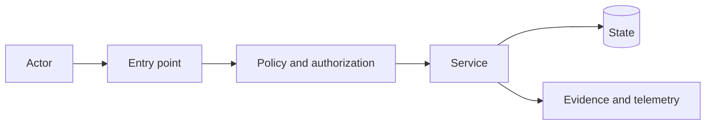

# RFC: <proposal title>

## Metadata

- **Status:** Draft | In review | Accepted | Rejected | Withdrawn | Superseded
- **Authors:** <authors>
- **Reviewers:** <reviewers or stakeholder groups>
- **Created:** <date>
- **Target decision date:** <date>
- **Related QART slices:** <links>
- **Resulting ADRs:** <links>
- **Related epics or issues:** <links>

## Summary

Describe the proposal, the problem it addresses, and the recommended direction. This section must stand on its own.

## Motivation

Explain the current limitation, user or operator impact, security or governance concern, strategic value, and why the proposal should be considered now.

## Goals

- <Required outcome>
- <Required system property>

## Non-goals

- <Adjacent work intentionally excluded>
- <Implementation detail intentionally left open>

## Background and current state

Describe the existing architecture, workflows, components, contracts, data and control flow, trust boundaries, limitations, and relevant prior decisions.

## Proposal

Describe the proposed system or change:

- Major components and responsibilities
- Interfaces and contracts
- State ownership
- Data and control flow
- Integration points
- Deployment model
- Failure handling
- Security and governance boundaries
- Evidence and observability

## Architecture

Replace the example and explain material trust boundaries.

## Detailed design

### Components and responsibilities

| Component | Responsibility |
|---|---|
| <Component> | <Responsibility> |

### Interfaces and contracts

Document applicable APIs, commands, events, configuration, file formats, schemas, error semantics, exit codes, and versioning guarantees.

### State and consistency model

Describe persistent and transient state, ownership, concurrency, consistency, idempotency, and recovery.

### Failure model

Describe dependency failures, invalid inputs, partial failure, retries, timeouts, degraded operation, and fail-open versus fail-closed behaviour.

## QART decision summary

| Question | Alternatives | Recommendation | Key trade-off | ADR |
|---|---|---|---|---|
| <Question> | <Options> | <Recommendation> | <Trade-off> | <Link or pending> |

Keep detailed analysis in separate QART documents when needed for reviewability.

## Security and governance

### Assets

- <Data, credentials, execution authority, policy, configuration, evidence>

### Threat actors and abuse cases

- <Threat or misuse case>

### Trust boundaries

- <Boundary>

### Required controls

- Authentication and authorization
- Input validation
- Isolation and least privilege
- Secret management
- Resource limits
- Audit evidence and provenance
- Detection and recovery

### Governance requirements

Document approval points, delegation constraints, policy enforcement, evidence retention, exceptions, and override authority.

### Residual risk

- <Remaining risk>

## Privacy and data handling

Document data classification, collection, access, retention, residency, redaction, deletion, and telemetry constraints.

## Operational design

Describe deployment, configuration, feature flags, health checks, metrics, logs, traces, alerts, capacity, backup, recovery, incident response, troubleshooting, and ownership.

## Compatibility and migration

Describe backward and forward compatibility, mixed-version behaviour, data and configuration migration, deprecation, staged rollout, and rollback.

## Alternatives considered

### Alternative: <name>

- **Advantages:**
- **Disadvantages:**
- **Reason rejected:**
- **Reconsider when:**

## Delivery plan

### Phase 1: <foundation>

- **Outcome:**
- **Scope:**
- **Validation:**
- **Rollback:**

### Phase 2: <integration>

<Repeat as needed.>

## Validation strategy

- Unit and contract tests
- Integration and end-to-end tests
- Security and adversarial tests
- Failure injection
- Compatibility and migration tests
- Performance tests
- Operational exercises
- Manual review or demo

Remove items that do not apply and add concrete success evidence.

## Success measures

- <Observable outcome or threshold>

## Risks

| Risk | Likelihood | Impact | Mitigation |
|---|---:|---:|---|
| <Risk> | Low / Medium / High | Low / Medium / High | <Mitigation> |

## Unresolved questions

Include only questions that materially affect approval. For each, identify alternatives, current recommendation, evidence needed, and decision owner.

## Decision and disposition

Complete after review.

- **Disposition:** Accepted | Rejected | Withdrawn | Superseded
- **Decision date:** <date>
- **Decision owners:** <owners>
- **Conditions of acceptance:** <conditions>
- **Required ADRs:** <links>
- **Required follow-up work:** <links>
