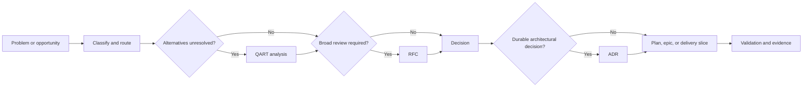

# Engineering work items

Micrantha uses different artifacts for exploration, decision-making, coordination, implementation, and validation. Use the smallest artifact set that preserves decision quality, traceability, and a bounded path to delivery.

## Decision-to-delivery flow

This is not mandatory ceremony. Skip artifacts that do not resolve uncertainty, communicate a contract, preserve a durable decision, coordinate meaningful work, or verify an outcome.

## Artifact taxonomy

| Artifact | Purpose | Complete when |
| --- | --- | --- |
| QART analysis | Explore one or more bounded decisions | Questions, viable alternatives, recommendation or evidence gap, trade-offs, and decision path are explicit |
| RFC | Obtain broad review for a consequential proposal | Review is resolved and disposition is recorded |
| ADR | Record an accepted durable decision | Context, decision, alternatives, consequences, scope, and reassessment triggers are authoritative |
| Epic or plan | Coordinate a larger outcome | Exit measures are achieved, not merely child issues closed |
| Specification | Define normative behavior or contracts | Independent implementations or reviewers can determine conformance |
| Investigation or spike | Reduce a defined uncertainty | Questions are answered with evidence and next action is clear |
| Engineering delivery slice | Implement one bounded cross-cutting outcome | Acceptance criteria and observable integration evidence are complete |
| Bug, feature, or security issue | Capture a directly classifiable need | The repository's specialized inherited form and acceptance criteria are satisfied |

## Selection rules

### Use QART when

- more than one credible alternative exists;
- the trade-off affects architecture, security, operations, compatibility, governance, cost, or delivery;
- evidence is needed before a responsible recommendation;
- a later RFC or ADR requires a defensible rationale.

Keep questions independently decidable where ownership, evidence, reversibility, or consequences differ.

### Use an RFC when

- the proposal crosses repository, component, team, public-contract, or trust boundaries;
- migration, compatibility, governance, security, or operational impact requires broader review;
- the change is costly or difficult to reverse;
- several related decisions need coherent review together.

### Use an ADR when

- the decision has actually been accepted;
- it constrains future architecture or implementation;
- future contributors need to understand why the choice was made;
- rediscovery or relitigation would be costly.

An ADR records a decision. It is not a proposal, backlog, or implementation plan.

### Use an epic or plan when

- several bounded outcomes must be coordinated;
- sequencing, dependencies, migration, rollout, or ownership materially affect delivery;
- completion is measured by an outcome rather than one implementation task.

The umbrella issue is a coordination surface. Always identify the next executable slice.

## Organization issue templates

Repositories that do not override organization templates can use:

- **Bug report** — reproducible defects;
- **Feature request** — a new user or system capability;
- **Security report** — non-sensitive public intake with private disclosure guidance;
- **Engineering delivery slice** — bounded cross-cutting implementation, integration, migration, infrastructure, or refactoring;
- **Design proposal** — exploratory or reviewed design work without prematurely assuming RFC status;
- **Epic or plan** — outcome-based coordination across decisions and delivery slices.

All active work items should follow the priority standard in [`CONTRIBUTING.md`](../../CONTRIBUTING.md). Priority is repository-global; `Blocked` is a separate status.

## Shared decision templates

- [QART template](templates/qart.md)
- [RFC template](templates/rfc.md)
- [ADR template](templates/adr.md)

## Related prompts

- [Classify and route engineering work](../prompts/planning/classify-and-route.md)
- [Issue grooming](../prompts/issues/issue-grooming.md)
- [QART decision analysis](../prompts/decisions/qart-analysis.md)
- [RFC development](../prompts/decisions/rfc-development.md)
- [QART-to-ADR conversion](../prompts/decisions/qart-to-adr.md)
- [Next executable slice](../prompts/planning/next-executable-slice.md)
- [Engineering artifact review](../prompts/reviews/engineering-artifact-review.md)

## Grooming standard

A useful artifact answers the applicable subset of:

1. What problem or opportunity exists, and what evidence supports it?
2. What observable outcome must become true?
3. What is explicitly in and out of scope?
4. Which facts, assumptions, constraints, and accepted decisions apply?
5. Which questions remain unresolved, and what evidence is needed?
6. What can fail, and what should failure, recovery, and rollback look like?
7. Which security, privacy, governance, trust, compatibility, or operational boundaries are affected?
8. How will success be verified?
9. What is the next bounded, dependency-ready action?

Do not add empty ceremonial sections. Include enough durable context to prevent rediscovery while keeping the artifact reviewable.
