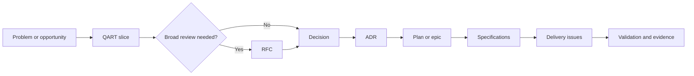

# Engineering work items

Micrantha uses different artifacts for exploration, decision-making, specification, and delivery. A bug template is not sufficient for architectural or planning work.

## Decision-to-delivery flow

The flow is not mandatory ceremony. Use only the artifacts needed to make the work understandable, reviewable, and durable.

## Artifact taxonomy

| Artifact | Purpose | Complete when |
|---|---|---|
| QART slice | Explore one bounded decision | Alternatives, recommendation, trade-offs, and residual risks are explicit |
| RFC | Review a substantial cross-boundary proposal | Review is resolved and disposition is recorded |
| ADR | Record an accepted durable decision | Decision, rationale, consequences, and revisit triggers are recorded |
| Epic | Coordinate a larger outcome | Outcome and exit measures are achieved |
| Plan | Sequence execution | Phases, dependencies, checkpoints, and contingencies are actionable |
| Specification | Define normative behaviour and contracts | Independent implementations can conform |
| Design | Resolve architecture and system boundaries | Material choices and failure modes are understood |
| Investigation / spike | Reduce uncertainty | Defined questions are answered with evidence |
| Delivery issue | Implement a bounded outcome | Acceptance criteria and definition of done are satisfied |

## Selection rules

### Use a QART slice when

- More than one credible alternative exists.
- The trade-off affects architecture, security, operations, compatibility, or delivery.
- A later RFC or ADR needs a defensible rationale.
- The team risks anchoring on the first implementation idea.

Keep each QART slice independently decidable.

### Use an RFC when

- The proposal changes an important system or trust boundary.
- Multiple repositories, components, teams, or public contracts are affected.
- Migration, compatibility, governance, or operational impact is substantial.
- The change is expensive or difficult to reverse.
- Multiple QART decisions need to be reviewed together.

### Use an ADR when

- The decision has been accepted.
- It constrains future architecture or implementation.
- Future contributors need to understand why it was chosen.
- Rediscovering or relitigating the decision would be costly.

An ADR records a decision; it is not a proposal document.

### Use an epic or plan when

- Several independently valuable outcomes must be coordinated.
- Sequencing, dependencies, rollout, or ownership materially affect delivery.
- Success is measured by an outcome rather than closure of one implementation task.

## Grooming standard

Every work item should answer the applicable subset of:

1. Why does this matter?
2. What outcome must become true?
3. What is explicitly in and out of scope?
4. Which facts, assumptions, constraints, and decisions apply?
5. How will success be verified?
6. What can fail, and how should failure behave?
7. Which security, privacy, governance, and trust boundaries are affected?
8. What are the rollout, migration, compatibility, and rollback implications?
9. Can delivery be split into independently reviewable and mergeable slices?

Do not add empty ceremonial sections. Include enough detail to prevent rediscovery while keeping the artifact reviewable.

## Shared templates

- [QART](templates/qart.md)
- [RFC](templates/rfc.md)
- [ADR](templates/adr.md)

Organization-level issue templates are located under `.github/ISSUE_TEMPLATE/` and are inherited by repositories that do not define their own templates.
