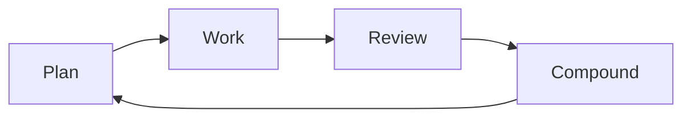
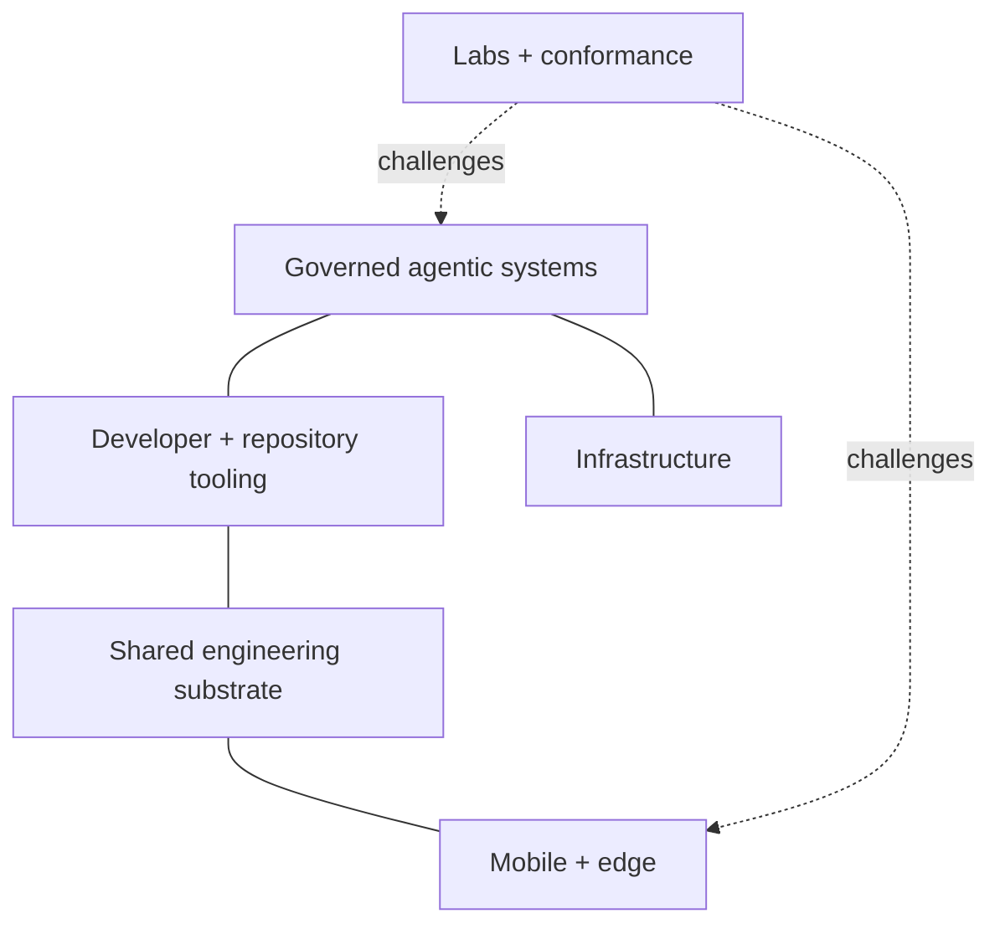
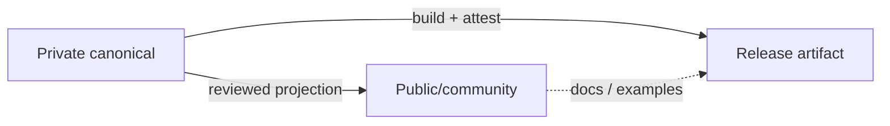

# 🌿 Micrantha

**Engineering resilient software systems.**

Micrantha is an engineering studio and software ecosystem focused on secure, observable platforms and disciplined AI-assisted development. The work explores how software can remain **understandable, operable, composable, and secure** as systems evolve over time.

Core areas include **platform engineering**, **mobile systems**, **infrastructure automation**, **developer tooling**, and **governed agentic development**.

🌐 [micrantha.com](https://micrantha.com)

---

## Engineering philosophy

Micrantha treats software as a living ecosystem: systems evolve through design, implementation, observation, review, and refinement rather than a one-time construction effort.



A few principles recur across the projects:

- **Composable by default.** Command-line tools should work cleanly through process boundaries, structured stdin/stdout, meaningful exit semantics, and documented man pages.
- **Explicit authority.** Identity, policy, evidence, execution, provenance, and observation are different concepts; one must not silently mint another.
- **Reproducible where practical.** Environments, inputs, plans, artifacts, and important decisions should be attributable and replayable.
- **Local-first where practical.** Local execution and user-controlled infrastructure are preferred when they materially improve privacy, operability, or resilience.
- **Evidence over assertion.** Logs, signatures, receipts, model output, test results, and observations are evidence inputs, not automatic authorization or product truth.
- **Small durable controls.** Repeated findings should become the weakest reliable control that prevents recurrence: tests, schemas, invariants, safer defaults, CI, policy, or bounded guidance.
- **Trust domains are explicit.** Public/private repositories, mirrors, agent workspaces, recovery stores, and canonical endpoints are modeled as deliberate topology rather than inferred from provider names.

Shared standards, architecture guidance, and the public responsibility map live in [`hackelia-micrantha/.github`](https://github.com/hackelia-micrantha/.github). A separate internal meta repository maintains the machine-readable ecosystem registry and aggregate status model.

---

## Project families

Micrantha is easier to understand as overlapping project families than as one dependency graph. Most projects remain independently useful and retain their own implementation authority.



### Governed agentic systems

- **Dubnium** — rebuildable workstation/runtime environment, local model execution, supervisor-specialist orchestration, memory, scheduling, and bounded automation.
- **Anthesis** — policy, capability, approval, evidence, provenance, and trusted-state governance for consequential effects.
- **Invokrum** — deterministic prompt/context composition, manifests, locks, and exact context identity.
- **Modolia** — deterministic model-surface eligibility and routing decisions; runtime provider execution remains separate.
- **Keylix** — sender-constrained OAuth/DPoP and proof-of-possession primitives.
- **Sandcastle** — persistent checkpoint identity and mutable-workspace lineage for disposable execution environments.
- **Testule** — portable testability contracts, native-tool adapters, verification requirements, and normalized testing evidence.

The core boundary is deliberately non-collapsing:

```text
context identity != execution authority
sender proof      != application authorization
verification      != promotion authority
memory/history    != current trusted guidance
evidence          != permission
```

### Developer and repository tooling

- **Repora / `repoctl`** — explicit repository topology, observation, exact plans, stale-safe reconciliation, managed artifacts, posture collection, and execution evidence.
- **Calathea** — deterministic portfolio/workflow orientation and prioritization, with reusable public contracts separated from private portfolio data and dogfood composition.

Micrantha CLI tools follow the shared [CLI interoperability standard](https://github.com/hackelia-micrantha/.github/blob/main/docs/standards/cli-interoperability.md): machine-readable interfaces should remain usable through ordinary Unix composition as well as higher-level orchestration.

### Infrastructure

- **Dubnium** — trusted workstation/device environment, private-network substrate, development runtime, and local agentic control plane.
- **Hyperion** — reproducible provisioned infrastructure, K3s, and GitOps workload convergence.

These scopes complement each other: Dubnium owns the workstation/runtime environment; Hyperion owns provisioned service infrastructure.

### Mobile and edge

- **Amaryllis** — React Native foundation for on-device multimodal inference and governed AI-enabled UI.
- **Achillea** — platform/SDK for guided outdoor experiences, with Asterwild as its first product consumer.
- **Bluebell** — Kotlin Multiplatform SDK/application foundation.
- **Digitalis** — mobile attestation and backend-authoritative secure-configuration experiments.
- **Envuscator** — build-time mobile configuration obfuscation and delivery tooling.
- **Myosotis** — governed field-operated AI tool protocols and SDK architecture.
- **Morifolium** — versioned mobile platform-engineering golden path and reference distribution.

These are parallel and composable capabilities rather than one mandatory mobile stack.

### Shared engineering substrate

- **Phyllotaxis** — shared, themeable design-system/UI substrate for Micrantha project sites. Current contract work starts with **Venation** layout/primitives; related concerns include **Chroma** themes/tokens, **Lamina** surfaces/cards, and **Cambium** migration/generation tooling.
- **Organization standards and prompts** — shared engineering, security, testing, release, documentation, review, and Compound-engineering conventions in `.github`.

A shared substrate defines reusable contracts; consuming projects retain their own content, product behavior, information architecture, deployment, and brand decisions.

### Labs and conformance

Laboratories exist to challenge product and architecture contracts rather than become hidden production dependencies. Governance labs, adversarial fixtures, and governed-agent reference integrations produce evidence that authoritative projects can accept, reject, or use to refine their own contracts.

---

## Repository topology and trust domains

Provider and visibility are not authority models.

```text
logical repository
  -> endpoint(s)
  -> explicit role / trust domain
  -> directed mirror, projection, promotion, import, or archive relationship
```

A common private/public pattern is a **projection**, not informal bidirectional synchronization:



`canonical`, `private`, `public`, `agent`, `mirror`, and `recovery` describe topology or policy context. None grants read, write, publish, merge, or promotion authority by itself.

See [repository topology and trust-domain patterns](https://github.com/hackelia-micrantha/.github/blob/main/docs/architecture/repository-topology-and-trust-domains.md).

---

## Where to look

- [Micrantha website](https://micrantha.com) — public project and engineering material
- [Organization defaults](https://github.com/hackelia-micrantha/.github) — governance, engineering standards, prompts, templates, and shared automation
- [Repository responsibility catalogue](https://github.com/hackelia-micrantha/.github/blob/main/docs/architecture/repository-catalogue.md) — public organization-level responsibility map
