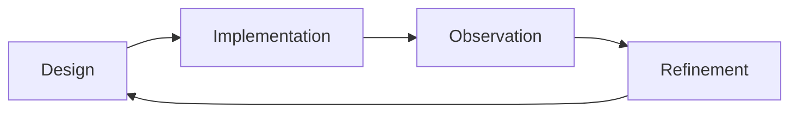
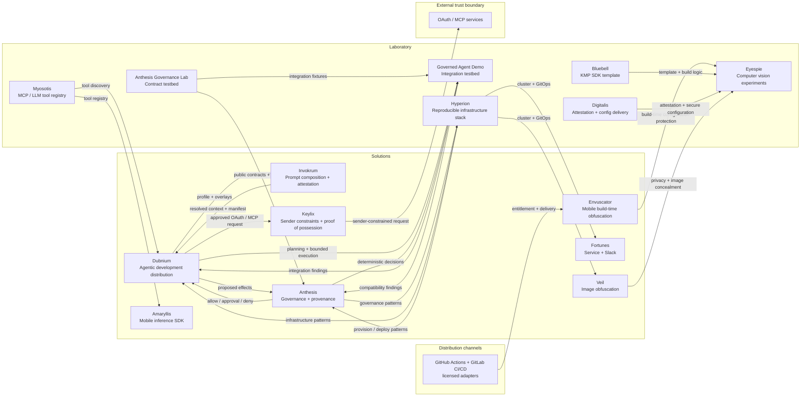
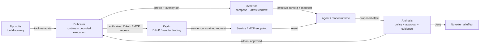

# 🌿 Micrantha

**Engineering resilient software systems.**

Micrantha is an engineering studio and open-source ecosystem focused on building secure, observable platforms and disciplined AI-assisted development systems. Its work explores how modern software can remain **understandable, operable, and secure** as systems evolve over time.

Core areas of focus include **platform engineering**, **mobile systems**, **infrastructure automation**, and **governed agentic development**.

🌐 [https://micrantha.com](https://micrantha.com)

---

## 🌱 Philosophy

Micrantha treats software as a **living ecosystem**—one that evolves through observation, iteration, and refinement rather than a one-time construction effort.

Systems grow through a continuous engineering loop:

This reflects the Micrantha gardening metaphor, where systems develop and mature through careful cultivation and iteration.

| Garden element | Engineering meaning                          |
| -------------- | -------------------------------------------- |
| Soil           | Infrastructure and architectural foundations |
| Seed           | Initial design and constraints               |
| Water          | Iteration and engineering effort             |
| Sunlight       | Observability and real-world feedback        |
| Flower         | Delivered system                             |
| Garden         | Ecosystem of systems maintained over time    |

The objective is simple: build systems that **remain understandable and maintainable as they grow**.

---

## ⚙️ What Micrantha builds

These domains represent the primary areas of engineering focus across Micrantha projects and research. Together they form the foundation of the Micrantha ecosystem and shape how platforms, infrastructure, and experimental systems evolve and interact.

The projects described later combine these domains in different ways to explore, prototype, and operate real systems.

### Platform engineering

* Reproducible environments and opinionated distributions
* Safe delivery through GitOps and CI/CD
* Secrets management and configuration hygiene
* Observability-first operations
* Explicit runtime, workload, and trust boundaries

### Mobile systems

* Android (Kotlin) and iOS (Swift)
* React Native with native module integration
* Kotlin Multiplatform SDK development
* Mobile authentication flows and platform hardening
* On-device inference experiments
* Mobile security: pentest analysis, device attestation, build-time obfuscation, and cryptographic agility

### Agentic development

* Local-first agentic systems and model routing
* Deterministic prompt-overlay composition and attestation
* Agent-assisted workflows with deterministic governance
* Traceability from RFCs through plans, tasks, implementation, and evidence
* Bounded, reviewable, and reversible automation
* Context engineering, reusable skills, and governed memory

### Security engineering

* Authentication models (OAuth, PKCE, workload identity, sender constraints, and token strategies)
* OAuth DPoP and proof-of-possession for MCP and agentic workloads
* Threat modeling
* Secure coding practices and dependency hygiene
* Secrets management and supply-chain awareness
* Security treated as a **system property** rather than a feature

---

## 🔭 Current engineering direction — August 2026

Recent work is making the agentic security model more explicit by separating mechanisms that are often collapsed into a single "agent security" layer:

* **Dubnium** remains the local-first agentic development distribution and bounded execution environment.
* **Invokrum v0.1.0** adds deterministic prompt-overlay composition, lockfile verification, provenance, and attestable effective context before an agent or model is invoked.
* **Anthesis** remains the governance and provenance boundary for proposed effects: policy evaluation, approvals, decisions, and retained evidence.
* **Keylix** adds sender-constrained authorization and proof-of-possession primitives for OAuth, DPoP, MCP, and agentic workloads. Its v0.1 security design is accepted, while implementation remains pre-release.
* **Anthesis Governance Lab** provides executable contract and adversarial scenarios so governance behavior can be tested independently of the agent runtime.
* The mobile-security track continues to separate concerns across **Envuscator** for build-time configuration protection and **Digitalis** for application attestation and secure configuration delivery.

The result is a layered model: **compose and attest context, govern effects, constrain credential use, and retain evidence**. These are complementary controls rather than interchangeable implementations of the same boundary.

---

## 🗺️ Architecture map

This diagram illustrates how core Micrantha projects relate. **Solutions** are systems intended for deployment and reuse; **Laboratory** projects validate contracts, exercise integrations, and incubate new architectural approaches. Runtime and development relationships intentionally cross that boundary.

High-level relationships across the Micrantha ecosystem (not all repositories shown):

### Governed agent execution path

The governed agent path makes the control boundaries more explicit:

The boundaries answer different questions:

* **Invokrum:** what exact instruction and context set is being executed, and can it be reproduced and attested?
* **Anthesis:** is the proposed effect permitted, approved when necessary, and captured as evidence?
* **Keylix:** is credential use cryptographically bound to the intended sender/key rather than replayable as a bearer credential?

Keylix does not replace identity, token validation, scopes, policy, TLS, or Anthesis authorization decisions. It adds proof-of-possession as a defense-in-depth boundary around credential use.

> Some Micrantha implementations and reference integrations currently live under [`ryjen`](https://github.com/ryjen) while their ownership and public distribution boundaries are consolidated into the Micrantha organization. Repository placement is transitional; architectural responsibility is documented explicitly.

---

## 🌿 Project maturity model

Micrantha projects move through practical development stages that reflect increasing stability and operational readiness.

| Stage          | Meaning                                            |
| -------------- | -------------------------------------------------- |
| **Prototype**  | Early exploration or architectural experimentation |
| **Incubating** | Active development with stabilizing architecture   |
| **Stable**     | Production-ready system with reliable interfaces   |
| **Maintained** | Mature system supported long-term                  |

---

## 📦 Projects

Projects are organized into two groups:

* **Solutions** — deployable systems, distributions, tools, and platforms
* **Laboratory** — testbeds and experimental projects that validate contracts, integrations, and emerging capabilities

These groups describe product intent rather than strict dependency direction. Laboratory projects may exercise Solutions, and findings from those integrations may change Solution architecture.

### Solutions

* **[Dubnium](https://github.com/hackelia-micrantha/dubnium-community)** *(Incubating)* — Micrantha's reproducible, local-first distribution for agentic software development and operations, combining model routing, development environments, governed automation, bounded execution, and auditable workflows
* **[Invokrum](https://github.com/hackelia-micrantha/invokrum)** *(Incubating)* — deterministic prompt-overlay composition and attestation engine for governed AI contexts, with reproducible manifests, lockfile verification, provenance, and a host-independent integration contract
* **[Anthesis](https://anthesis.micrantha.com)** *(Incubating)* — deterministic governance and provenance platform for evaluating proposed agent actions, requiring approvals, and retaining traceable decision evidence
* **[Keylix](https://github.com/hackelia-micrantha/keylix)** *(Prototype)* — sender-constrained authorization and proof-of-possession primitives for OAuth, DPoP, MCP, and agentic workloads; the v0.1 security design is accepted and implementation remains pre-release
* **[Envuscator](https://github.com/hackelia-micrantha/envuscator-community)** *(Incubating)* — mobile build-time configuration obfuscation delivered through a provider-neutral engine, local CLI, and licensed GitHub Actions and GitLab CI/CD adapters; customer build content remains on customer-controlled runners
* **[Amaryllis](https://amaryllis.micrantha.com)** *(Prototype)* — mobile inference toolkit exploring privacy-preserving on-device ML
* **[Fortunes](https://fortunes.micrantha.com)** *(Stable)* — lightweight microservice and Slack integration used to explore deployment patterns
* **[Veil](https://veil.micrantha.com)** *(Prototype)* — experimental service for image obfuscation and privacy utilities

### Laboratory

* **[Anthesis Governance Lab](https://github.com/ryjen/anthesis-governance-lab)** *(Incubating)* — public executable testbed for Anthesis contracts, canonical policy scenarios, adversarial cases, and integration compatibility
* **Dubnium Governed Agent Demo** *(Prototype)* — vertical integration testbed demonstrating Anthesis policy decisions and approvals in front of Dubnium's bounded executor
* **[Hyperion](https://hyperion.micrantha.com)** *(Incubating)* — reproducible infrastructure stack built around K3s and GitOps workflows
* **[Bluebell](https://github.com/hackelia-micrantha/bluebell)** *(Stable)* — Kotlin Multiplatform SDK template supporting cross-platform library development
* **[Digitalis](https://github.com/hackelia-micrantha/digitalis-community)** *(Prototype)* — mobile attestation and secure configuration delivery system
* **[Myosotis](https://github.com/hackelia-micrantha/myosotis-community)** *(Prototype)* — experimental MCP and LLM registry for agent tool discovery
* **Eyespie** *(Prototype)* — computer-vision-driven gameplay and mobile inference experiments

---

## 🧠 Technical credibility

* 15+ years of engineering across mobile, backend, infrastructure, and security
* Experience delivering production mobile systems used by millions of users across enterprise and consumer platforms
* Strong emphasis on operational learning: CI/CD guardrails, observability, and incident feedback loops

Credentials and trajectory:

* CSSLP (Associate)
* Kubernetes CKA / CKS (planned)
* Azure certifications (planned)

---

## 📊 Operational posture

Micrantha projects treat **operability as a first-class design constraint**. Systems are expected to be observable, diagnosable, and recoverable in production.

Typical operational practices include:

* **GitOps deployments** using declarative infrastructure
* **Reproducible environments** through infrastructure as code
* **Observability-first design** through logs, metrics, traces, and structured evidence
* **Operational runbooks** for known failure modes
* **Incident learning loops** to prevent recurrence

Operational priorities:

* predictable deployments
* rapid fault isolation
* minimal blast radius
* reversible changes

For systems reaching **Stable** or **Maintained** maturity, projects typically introduce:

* service health checks
* monitoring and alerting
* SLO-informed operational decisions

---

## 🔐 Security posture

Micrantha treats security as an **architectural property of the system**, not an afterthought.

Security practices commonly emphasized include:

* **Threat modeling during system design**
* **Secure authentication models** including OAuth, PKCE, workload identity, sender constraints, and bounded token lifecycles
* **Deterministic and attestable agent context** where instructions affect authority or execution behavior
* **Proof-of-possession** for credential use where bearer-token replay is an unacceptable risk
* **Secrets management and rotation**
* **Clear trust boundaries between services, agents, policy engines, executors, and credential holders**
* **Supply-chain awareness** for dependencies, adapters, engines, and build pipelines

Security goals:

* minimize attack surface
* isolate trust domains
* prevent secret leakage and credential replay
* fail closed at authorization and verification boundaries
* enable rapid patching when vulnerabilities emerge

Where appropriate, projects may also incorporate:

* SBOM generation
* artifact signing and immutable release identities
* dependency auditing
* provenance and evidence capture

These practices help ensure systems remain **secure as they evolve and scale**.

---

## 📬 Contact

Ryan Jennings  
Micrantha Software Solutions

🌐 [https://micrantha.com](https://micrantha.com)

---

> Systems that grow without discipline eventually collapse under their own complexity.
