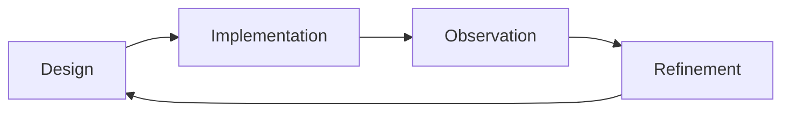
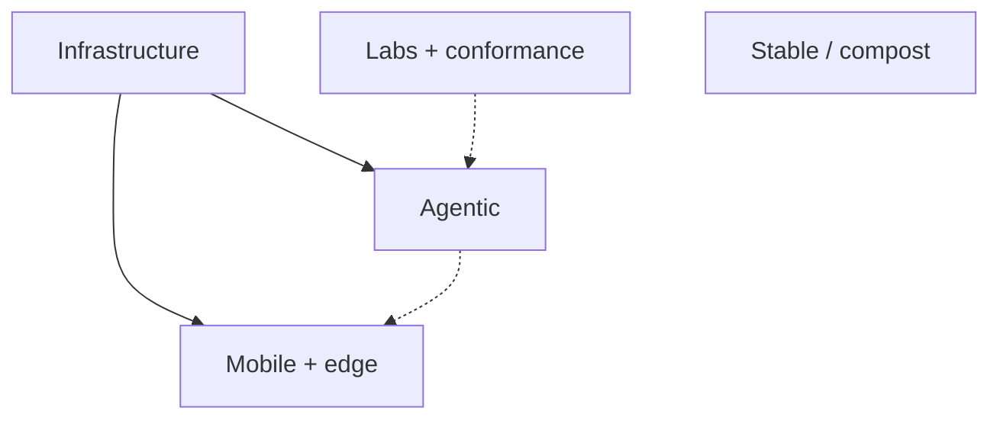
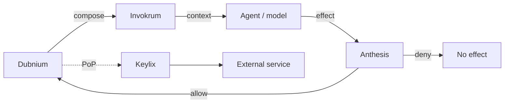
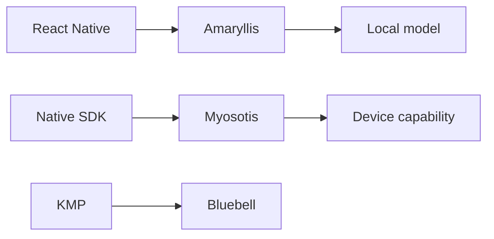
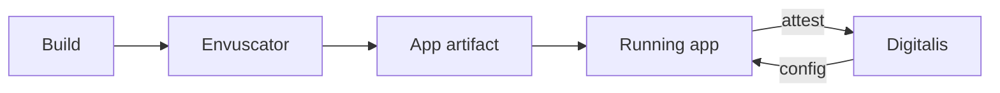
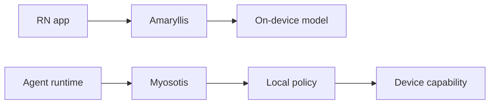
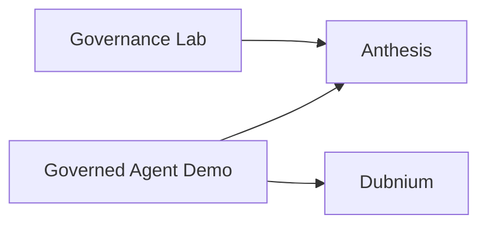

# 🌿 Micrantha

**Engineering resilient software systems.**

Micrantha is an engineering studio and open-source ecosystem focused on secure, observable platforms and disciplined AI-assisted development systems. The work explores how modern software can remain **understandable, operable, and secure** as systems evolve over time.

Core areas of focus include **platform engineering**, **mobile systems**, **infrastructure automation**, and **governed agentic development**.

🌐 [https://micrantha.com](https://micrantha.com)

---

## 🌱 Philosophy

Micrantha treats software as a **living ecosystem**—one that evolves through observation, iteration, and refinement rather than a one-time construction effort.

| Garden element | Engineering meaning |
| --- | --- |
| Soil | Infrastructure and architectural foundations |
| Seed | Initial design and constraints |
| Water | Iteration and engineering effort |
| Sunlight | Observability and real-world feedback |
| Flower | Delivered system |
| Garden | Ecosystem of systems maintained over time |
| Compost | Completed work whose useful ideas feed newer systems |

The objective is simple: build systems that **remain understandable and maintainable as they grow**.

---

## ⚙️ Engineering focus

### Platform engineering

* Reproducible environments and opinionated distributions
* Safe delivery through GitOps and CI/CD
* Secrets management and configuration hygiene
* Observability-first operations
* Explicit runtime, workload, and trust boundaries

### Mobile systems

* Android, iOS, React Native, and Kotlin Multiplatform
* Mobile authentication flows and platform hardening
* On-device inference and governed device capabilities
* Application attestation and secure configuration
* Build-time obfuscation and cryptographic agility

### Agentic development

* Local-first agentic systems and model routing
* Deterministic prompt-overlay composition and attestation
* Deterministic governance of proposed effects
* Bounded, reviewable, and reversible automation
* Traceability from design through execution and evidence
* Context engineering, reusable skills, and governed memory

### Security engineering

* OAuth, PKCE, workload identity, sender constraints, and bounded token lifecycles
* Proof-of-possession for OAuth, MCP, and agentic workloads
* Threat modeling and secure SDLC practices
* Secrets management and supply-chain security
* Security treated as a **system property** rather than a feature

---

## 🗺️ How the projects fit together

Micrantha is easier to understand as several **project families** rather than one dependency graph.

The boxes are **families, not layers that every system must traverse**:

* **Agentic:** Dubnium, Invokrum, Anthesis, and Keylix
* **Mobile + edge:** Myosotis, Amaryllis, Digitalis, Envuscator, Bluebell, and Eyespie
* **Infrastructure:** Hyperion
* **Labs + conformance:** Anthesis Governance Lab and governed-agent demos
* **Stable / compost:** Fortunes and Veil

Most projects intentionally solve one narrow problem and remain independently useful.

### 1. Governed agentic control plane

The core agentic path has four distinct responsibilities:

Each project answers a different question:

| Project | Responsibility |
| --- | --- |
| **Dubnium** | Where does the agent run, how is work routed, and how are allowed effects executed within bounded capabilities? |
| **Invokrum** | What exact instruction/context set entered the invocation, and can it be reproduced and attested? |
| **Anthesis** | Is a proposed effect permitted, does it require approval, and what evidence records the decision? |
| **Keylix** | When credentials are used, can their use be cryptographically bound to the intended sender instead of remaining replayable bearer credentials? |

**Keylix is conditional defense in depth**, not a mandatory hop for every agent action. It does not replace identity, OAuth token validation, scopes, TLS, or Anthesis policy.

Model routing, specialist selection, memory, and scheduling remain Dubnium capabilities rather than additional peer layers in this diagram.

### 2. Mobile and edge systems

The mobile family contains **parallel implementation streams**, not one shared cross-platform stack.

#### Implementation streams

* **React Native / local AI:** Amaryllis is the concrete Micrantha runtime for on-device multimodal inference and governed AI-enabled UI.
* **Native SDK / governed capabilities:** Myosotis is protocol-neutral but currently proves its first reference runtime with native Kotlin on Android. Swift interoperability is the next platform checkpoint; a shared KMP core is deliberately deferred until the protocol boundary is better proven.
* **Kotlin Multiplatform:** Bluebell is the reusable KMP architecture and SDK foundation across Android, iOS, JVM, and Linux. It is model-ready, but it is not an AI inference engine equivalent to Amaryllis.

These streams may share patterns and integrations, but **React Native, native platform SDKs, and KMP should not be collapsed into one implementation path**.

#### Mobile security boundaries

Digitalis and Envuscator are cross-cutting security controls rather than application frameworks:

* **Envuscator is a build-time boundary:** it hardens selected mobile configuration during Android/iOS delivery. It does not provide runtime authorization, application attestation, or secure backend design.
* **Digitalis is a runtime trust-bootstrap boundary:** the application presents bounded attestation evidence to a backend-authoritative verifier before protected configuration is released. Attestation does not replace user identity, authorization, local policy, or consent.
* Both controls can apply to multiple mobile implementation streams. Concrete adapters may differ by platform; neither implies React Native, KMP, or Myosotis as a mandatory dependency.

#### AI integration paths

Micrantha currently has two distinct mobile/AI integration patterns:

* **Local inference:** Amaryllis keeps model execution inside the mobile application and treats model output as untrusted input behind application-owned contracts.
* **Agent-to-device capabilities:** Myosotis lets an external or local agent request narrow mobile capabilities while the device retains authority over policy, operator consent, execution, and audit. Dubnium is a natural Micrantha-side agent runtime integration, but Myosotis does not depend on Dubnium.
* **Bluebell** can host model-ready KMP application architecture, but no dedicated Micrantha KMP inference runtime is currently presented as equivalent to Amaryllis.
* **Digitalis** can strengthen the trust bootstrap around a mobile application; **Envuscator** can harden its delivered configuration. Neither grants an AI model or agent additional authority.

**Eyespie** remains an experimental consumer of mobile and computer-vision techniques rather than a foundational mobile runtime.

### 3. Infrastructure and deployment

Hyperion is infrastructure rather than an application-domain dependency.

It provides reproducible infrastructure and GitOps patterns that can host Micrantha services without becoming part of their application-level trust model.

### 4. Laboratories and conformance

Laboratory projects exist to **challenge architecture rather than become hidden production dependencies**.

The Governance Lab exercises policy contracts and adversarial scenarios independently. Governed-agent demos provide vertical integration evidence across runtime and governance boundaries.

### 5. Stable work and compost

**Fortunes** and **Veil** are stable projects with no active product roadmap. They remain useful as completed reference systems, but both are candidates for **composting** when their remaining operational or reference value no longer justifies maintenance.

Composting means retiring the active project while preserving useful patterns, lessons, or reusable components elsewhere in the ecosystem.

---

## 🔭 Current engineering direction — August 2026

* **Invokrum v0.1.0** establishes deterministic local composition, lockfile verification, provenance, and attestable effective context.
* **Keylix** has an accepted v0.1 security design for OAuth DPoP and sender-constrained agent/MCP workloads; implementation remains pre-release.
* **Dubnium** continues to own the local-first runtime, supervisor, model-routing, specialist, memory, scheduling, and bounded-execution concerns.
* **Anthesis** remains the policy, approval, evidence, and provenance authority rather than absorbing runtime responsibilities.
* **Myosotis** is positioned around governed mobile capabilities, with an Android-native Kotlin reference SDK first and a Swift interoperability checkpoint before any shared-core decision.
* **Amaryllis** is an active 0.1.x React Native foundation for on-device multimodal AI and governed AI-enabled UI.
* **Bluebell** remains the Kotlin Multiplatform architecture and SDK foundation rather than being conflated with the React Native AI runtime.
* **Digitalis** and **Envuscator** address different mobile-security phases: runtime/application trust versus build-time hardening.
* **Fortunes** and **Veil** are stable, complete work with no planned feature trajectory and are future compost candidates.

The recurring design principle is **separation of authority**: context composition, policy, execution, credentials, application trust, and infrastructure should remain explicit boundaries rather than collapse into one agent platform.

---

## 🌿 Maturity and lifecycle

**Maturity** describes technical stability. **Lifecycle** describes whether Micrantha is actively investing in the project. They are deliberately separate.

### Maturity

| Stage | Meaning |
| --- | --- |
| **Prototype** | Early exploration or architectural experimentation |
| **Incubating** | Active implementation with stabilizing contracts |
| **Stable** | Reliable interfaces and demonstrated operational usefulness |

### Lifecycle

| State | Meaning |
| --- | --- |
| **Active** | Current design or implementation investment |
| **Maintenance** | Supported with limited feature work |
| **Complete** | No planned feature trajectory; retained while useful |
| **Compost** | Retired as an active project after useful ideas or components are preserved |

---

## 📦 Project map

| Project | Family | Role | Maturity | Lifecycle |
| --- | --- | --- | --- | --- |
| **[Dubnium](https://github.com/hackelia-micrantha/dubnium-community)** | Agentic | Local-first agentic development and operations runtime | Incubating | Active |
| **[Invokrum](https://github.com/hackelia-micrantha/invokrum)** | Agentic | Deterministic prompt-overlay composition and attestation | Incubating | Active |
| **[Anthesis](https://anthesis.micrantha.com)** | Agentic | Governance, approval, provenance, and evidence | Incubating | Active |
| **[Keylix](https://github.com/hackelia-micrantha/keylix)** | Agentic / Security | Sender-constrained OAuth and proof-of-possession primitives | Prototype | Active |
| **[Myosotis](https://github.com/hackelia-micrantha/myosotis-community)** | Mobile / Agentic | Native-first governed mobile capability protocol and SDK | Prototype | Active |
| **[Amaryllis](https://amaryllis.micrantha.com)** | Mobile / React Native / AI | On-device multimodal AI and governed component/runtime primitives | Incubating | Active |
| **[Digitalis](https://github.com/hackelia-micrantha/digitalis-community)** | Mobile / Security | Runtime application trust, attestation, and protected configuration | Prototype | Active |
| **[Envuscator](https://github.com/hackelia-micrantha/envuscator-community)** | Mobile / Security | Build-time configuration obfuscation and delivery hardening | Incubating | Active |
| **[Bluebell](https://github.com/hackelia-micrantha/bluebell)** | Mobile / KMP | Kotlin Multiplatform SDK architecture and reusable patterns | Stable | Maintenance |
| **Eyespie** | Mobile / Lab | Computer-vision and mobile inference experiments | Prototype | Active |
| **[Hyperion](https://hyperion.micrantha.com)** | Infrastructure | Reproducible K3s/GitOps infrastructure stack | Incubating | Active |
| **[Anthesis Governance Lab](https://github.com/ryjen/anthesis-governance-lab)** | Laboratory | Executable governance contracts and adversarial scenarios | Incubating | Active |
| **Dubnium Governed Agent Demo** | Laboratory | Vertical runtime/governance integration testbed | Prototype | Active |
| **[Fortunes](https://fortunes.micrantha.com)** | Reference | Lightweight service and Slack integration | Stable | Complete → Compost |
| **[Veil](https://veil.micrantha.com)** | Reference | Image-obfuscation and privacy experiment | Stable | Complete → Compost |

> Some Micrantha implementations and reference integrations currently live under [`ryjen`](https://github.com/ryjen) while ownership and public distribution boundaries are consolidated. Repository placement is transitional; architectural responsibility should remain explicit.

---

## 🧠 Engineering background and development

Micrantha is informed by more than 15 years of engineering across mobile, backend, infrastructure, platform engineering, and software security, including production mobile systems used by millions of users.

Current public credential and development trajectory:

* **Associate of ISC2** — verified public designation supporting secure-SDLC, secure-design, threat-modeling, and application-security governance work
* **Agentic / AI governance credential** — planned; specific program or provider to be selected
* Continued practical development through Micrantha's governed-agent, application-security, platform, and secure-AI projects

Credential names are kept conservative: planned study is not presented as certification, and public designation follows issuer requirements.

---

## 📊 Operational posture

Micrantha treats **operability as a first-class design constraint**.

Typical practices include:

* GitOps and reproducible infrastructure
* logs, metrics, traces, and structured evidence
* runbooks for known failure modes
* small blast radii and reversible changes
* CI/CD guardrails and supply-chain validation
* incident and integration feedback loops

---

## 🔐 Security posture

Micrantha treats security as an **architectural property of the system**.

Common principles include:

* threat modeling during system design
* explicit trust and authority boundaries
* fail-closed authorization and verification
* sender-constrained credentials where replay resistance matters
* deterministic and attestable agent context where instructions affect authority
* secrets management and rotation
* dependency and supply-chain hygiene
* SBOMs, artifact signing, provenance, and evidence where appropriate

The goal is not to make every project depend on every security component. The goal is to make the applicable trust boundaries **visible, composable, and independently testable**.

---

## 📬 Contact

Ryan Jennings  
Micrantha Software Solutions

🌐 [https://micrantha.com](https://micrantha.com)

---

> Systems that grow without discipline eventually collapse under their own complexity.
