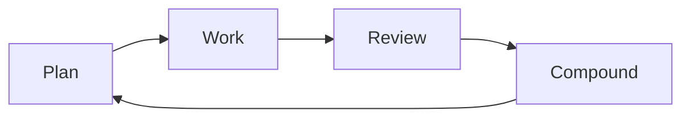
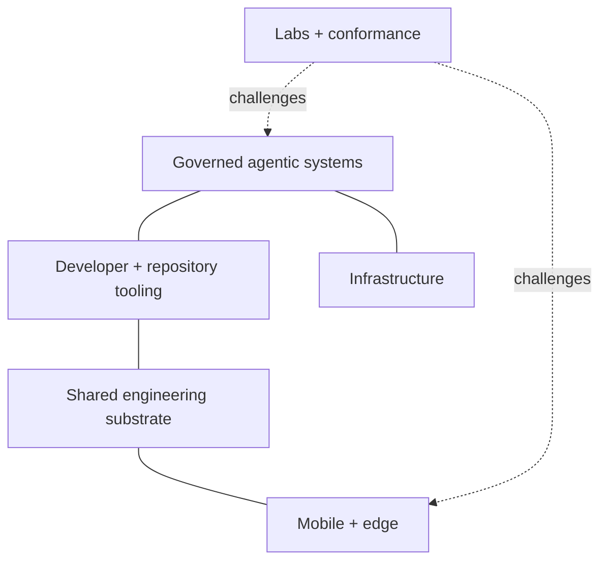
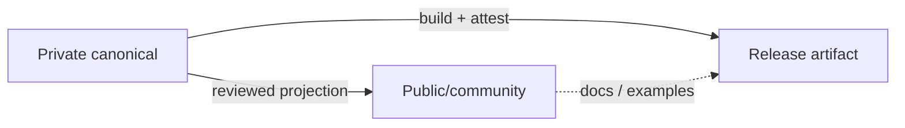

# 🌿 Micrantha

**Engineering resilient software systems.**

Micrantha is an engineering studio and software ecosystem focused on secure, observable platforms and disciplined AI-assisted development. The work explores how software can remain **understandable, operable, composable, and secure** as systems evolve over time.

Core areas include **platform engineering**, **mobile systems**, **infrastructure automation**, **developer tooling**, and **governed agentic development**, with an emphasis on data sovereignty and user-controlled systems.

🌐 [micrantha.com](https://micrantha.com) · [Projects](#project-families) · [Engineering standards](#engineering-standards) · [Contributing](https://github.com/hackelia-micrantha/.github/blob/main/CONTRIBUTING.md)

---

## Engineering philosophy

Micrantha treats software as a living ecosystem: systems evolve through design, implementation, observation, review, and refinement rather than a one-time construction effort.

A few principles recur across the projects:

- **Composable by default.** Command-line tools should work cleanly through process boundaries, structured stdin/stdout, meaningful exit semantics, and documented man pages.
- **Explicit authority.** Identity, policy, evidence, execution, provenance, and observation are different concepts; one must not silently mint another.
- **Reproducible where practical.** Environments, inputs, plans, artifacts, and important decisions should be attributable and replayable.
- **Local-first where practical.** Local execution and user-controlled infrastructure are preferred when they materially improve privacy, operability, or resilience.
- **Evidence over assertion.** Logs, signatures, receipts, model output, test results, and observations are evidence inputs, not automatic authorization or product truth.
- **Small durable controls.** Repeated findings should become the weakest reliable control that prevents recurrence: tests, schemas, invariants, safer defaults, CI, policy, or bounded guidance.
- **Trust domains are explicit.** Public/private repositories, mirrors, agent workspaces, recovery stores, and canonical endpoints are modeled as deliberate topology rather than inferred from provider names.

Shared standards, architecture guidance, and the public responsibility map live in [`hackelia-micrantha/.github`](https://github.com/hackelia-micrantha/.github). A separate internal meta repository maintains the machine-readable ecosystem registry and aggregate status model.

---

## Project families

Micrantha is easier to understand as overlapping project families than as one dependency graph. Projects retain their own implementation authority. The descriptions below summarize project scope, not a guarantee that every capability is released or integrated. Follow each public repository for current availability, licensing, and maturity; community repositories may publish contracts and artifacts without implementation source.

### Governed agentic systems

- **[Dubnium](https://github.com/hackelia-micrantha/dubnium-community)** — personal, self-hosted engineering environment and reference use case for local AI and bounded automation. Public contracts and conformance material are incubating; a generally available workstation/runtime distribution is not yet released.
- **[Anthesis](https://github.com/hackelia-micrantha/anthesis-community)** — portable, self-hostable governance for data sovereignty in agentic AI: deterministic policy decisions, capabilities, approvals, evidence, and provenance for consequential effects. Enforcement depends on the integrating tool or runtime controlling bypass paths; Anthesis alone does not guarantee data residency.
- **[Invokrum](https://github.com/hackelia-micrantha/invokrum-community)** — deterministic prompt/context composition, manifests, locks, and exact context identity.
- **[Modolia](https://github.com/hackelia-micrantha/modolia-community)** — deterministic model-surface eligibility and routing decisions; runtime provider execution remains separate.
- **[Keylix](https://github.com/hackelia-micrantha/keylix-community)** — sender-constrained OAuth/DPoP and proof-of-possession primitives.
- **[Sandcastle](https://github.com/hackelia-micrantha/sandcastle-community)** — persistent checkpoint identity and mutable-workspace lineage for disposable execution environments.
- **[Testule](https://github.com/hackelia-micrantha/testule-community)** — portable testability contracts, native-tool adapters, verification requirements, and normalized testing evidence.

Start with the bounded [Try Anthesis walkthrough](https://github.com/hackelia-micrantha/anthesis-community/blob/main/docs/product/try-anthesis.md). Testule currently publishes an incubating specification; a public binary release is still pending.

Context identity, sender proof, verification results, and historical memory each provide bounded evidence. None independently grants execution or promotion authority.

### Developer and repository tooling

- **[Repora / `repoctl`](https://github.com/hackelia-micrantha/repora)** — explicit repository topology, observation, exact plans, stale-safe reconciliation, managed artifacts, posture collection, and execution evidence.
- **[Calathea](https://github.com/hackelia-micrantha/calathea-community)** — deterministic portfolio/workflow orientation and prioritization, with reusable public contracts separated from private portfolio data and dogfood composition.

Micrantha CLI tools follow the shared [CLI interoperability standard](https://github.com/hackelia-micrantha/.github/blob/main/docs/standards/cli-interoperability.md): machine-readable interfaces should remain usable through ordinary Unix composition as well as higher-level orchestration.

### Infrastructure

- **[Dubnium](https://github.com/hackelia-micrantha/dubnium-community)** — personal workstation/runtime composition and bounded execution integration, with public conceptual documentation and experimental contracts.
- **[Hyperion](https://github.com/hackelia-micrantha/hyperion-community)** — reproducible provisioned infrastructure, K3s, and GitOps workload convergence.

These scopes complement each other: Dubnium owns the workstation/runtime environment; Hyperion owns provisioned service infrastructure.

### Mobile and edge

- **[Amaryllis](https://github.com/hackelia-micrantha/amaryllis)** — React Native foundation for on-device multimodal inference and governed AI-enabled UI.
- **[Achillea](https://github.com/hackelia-micrantha/achillea-community)** — platform/SDK for guided outdoor experiences, with Asterwild as its first product consumer.
- **[Bluebell](https://github.com/hackelia-micrantha/bluebell)** — Kotlin Multiplatform SDK/application foundation.
- **[Digitalis](https://github.com/hackelia-micrantha/digitalis-community)** — mobile attestation and backend-authoritative secure-configuration experiments.
- **[Envuscator](https://github.com/hackelia-micrantha/envuscator-community)** — build-time mobile configuration obfuscation and delivery tooling.
- **[Myosotis](https://github.com/hackelia-micrantha/myosotis-community)** — governed field-operated AI tool protocols and SDK architecture.
- **Morifolium** — versioned mobile platform-engineering golden path and reference distribution.

These are parallel and composable capabilities rather than one mandatory mobile stack.

### Shared engineering substrate

- **[Phyllotaxis](https://github.com/hackelia-micrantha/phyllotaxis)** — shared, themeable design-system/UI substrate for Micrantha project sites. Current contract work starts with **Venation** layout/primitives; related concerns include **Chroma** themes/tokens, **Lamina** surfaces/cards, and **Cambium** migration/generation tooling. The implementation repository is currently private; the link is useful to organization members with access until a reviewed public projection is established.
- **Organization standards and prompts** — shared engineering, security, testing, release, documentation, review, and Compound-engineering conventions in `.github`.

A shared substrate defines reusable contracts; consuming projects retain their own content, product behavior, information architecture, deployment, and brand decisions.

### Labs and conformance

Laboratories challenge product and architecture contracts. Their evidence does not independently establish production readiness or change a product contract.

- **[Anthesis Governance Lab](https://github.com/ryjen/anthesis-governance-lab)** — executable public scenarios and adversarial fixtures for deterministic governance evaluation. Evaluating declared effects does not prove enforcement in an external runtime.
- **[MUSICPKG](https://github.com/hackelia-micrantha/musicpkg-community)** — experimental owner-bound digital music format aimed at durable offline ownership and purchaser-controlled recovery. The public v0.2 Working Draft includes specifications, test vectors, and a bounded Rust reference conformance harness; complete package verification and end-to-end playback remain future work.

### Creative work

- **[Entanglement of Ages](https://github.com/ryjen/entanglement-of-ages-marketing)** — the multi-book creative project, presented through its separately reviewed public marketing surface.

---

## Engineering standards

The [shared standards](https://github.com/hackelia-micrantha/.github/blob/main/docs/standards/README.md) define expectations according to project maturity, risk, and supported surfaces. They are engineering requirements, not a blanket certification of every project.

- **[Testing](https://github.com/hackelia-micrantha/.github/blob/main/docs/standards/testing.md)** — a risk-shaped test pyramid, validation at the lowest trustworthy layer, and explicit gaps. Testule supplies portable contracts and normalized evidence where adopted; native tools execute the tests.
- **[CI/CD](https://github.com/hackelia-micrantha/.github/blob/main/docs/standards/ci-cd.md)** — exact-revision evidence, least-privilege workflows, explicit runner trust, and bounded concurrency. [Workflow review](https://github.com/hackelia-micrantha/.github/blob/main/skills/ci-workflow-review/SKILL.md) targets redundant computation while preserving independent evidence.
- **[Releases](https://github.com/hackelia-micrantha/.github/blob/main/docs/standards/releases.md)** — attributable artifacts, integrity verification, supported installation paths, compatibility, and rollback.
- **[Security](https://github.com/hackelia-micrantha/.github/blob/main/docs/standards/security.md)** and **[tool-result trust](https://github.com/hackelia-micrantha/.github/blob/main/docs/standards/tool-result-trust.md)** — explicit trust boundaries and evidence that cannot silently become permission.
- **[CLI interoperability](https://github.com/hackelia-micrantha/.github/blob/main/docs/standards/cli-interoperability.md)** — composable process interfaces, machine output, meaningful exit semantics, and man pages.
- **[Documentation](https://github.com/hackelia-micrantha/.github/blob/main/docs/standards/documentation.md)** — evidence-backed public claims, clear maturity, and reviewed publication boundaries.
- **[Community UI](https://github.com/hackelia-micrantha/.github/blob/main/docs/standards/ui-design.md)** — Phyllotaxis-aligned, content-first Utility interfaces with modern accessibility; Editorial styling where the publishing task warrants it.

[AI-assisted SDLC](https://github.com/hackelia-micrantha/.github/blob/main/docs/engineering/ai-assisted-sdlc.md) uses bounded work, explicit handoffs, verification, and risk-appropriate human review. [Operational skills](https://github.com/hackelia-micrantha/.github/blob/main/skills/README.md) remain project-local by default; shared skills and [engineering prompts](https://github.com/hackelia-micrantha/.github/blob/main/docs/prompts/README.md) are reusable guidance. [Model selection](https://github.com/hackelia-micrantha/.github/blob/main/docs/engineering/ai-model-selection.md) is risk-adaptive: frontier models are an escalation option, not a universal requirement.

---

## Repository topology and trust domains

Provider and visibility are not authority models.

A logical repository may have several endpoints. Each endpoint needs an explicit role and trust domain, with directed mirror, projection, promotion, import, or archive relationships.

A common private/public pattern is a **projection**, not informal bidirectional synchronization:

`canonical`, `private`, `public`, `agent`, `mirror`, and `recovery` describe topology or policy context. None grants read, write, publish, merge, or promotion authority by itself.

See [repository topology and trust-domain patterns](https://github.com/hackelia-micrantha/.github/blob/main/docs/architecture/repository-topology-and-trust-domains.md).

---

## Where to look

- [Micrantha website](https://micrantha.com) — public project and engineering material
- [Organization defaults](https://github.com/hackelia-micrantha/.github) — governance, engineering standards, prompts, templates, and shared automation
- [Repository responsibility catalogue](https://github.com/hackelia-micrantha/.github/blob/main/docs/architecture/repository-catalogue.md) — public organization-level responsibility map
